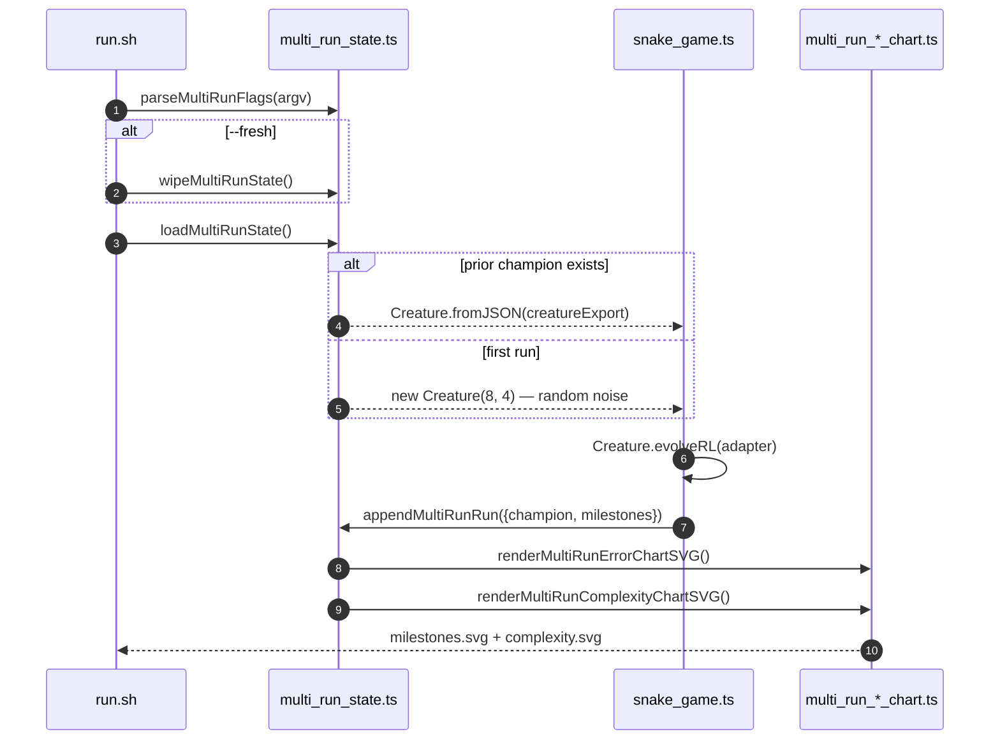

# PR #325 — snake_game: wire multi-run persistence and aggregate charts

## Summary

Wires the `snake_game` example to the shared multi-run persistence helpers and aggregate chart
renderers introduced under issues #318 / #319 / #320, replacing the legacy single-run milestone
chart with the multi-run pair. Closes #325.

- `snake_game.ts` now accepts a `seedCreatureExport` on `EvolveOptions` so the prior champion can
  carry forward across runs, exposes a `runMultiRunSnakeGame()` orchestrator, and a
  `milestoneToMultiRunSample()` converter that maps the adapter's cumulative reward to the
  snake-game error convention (`error = 1 − meanCappedEaten / SOLVED_THRESHOLD` modulo the bounded
  Manhattan shaping term).
- `--fresh` / `--timeout=<minutes>` / `--target-error=<value>` are parsed via `parseMultiRunFlags`.
  Multi-run defaults: 5-minute timeout, target error `0.01`.
- The runner saves the champion + merged milestones under `docs/data/snake_game/`, renders both new
  charts to `docs/screenshots/snake_game/milestones.svg` and
  `docs/screenshots/snake_game/complexity.svg`, and removes the deprecated single-run
  `docs/screenshots/snake_game_milestones.svg` artefact.
- `snake_game/run.sh` now reformats both new chart SVGs so `deno fmt --check` stays clean.
- `quality.sh` invokes the example with `SNAKE_QUICK=1` (mirroring the cart-pole / maze idiom) so CI
  runs cap at `iterations: 3` under a temp directory and never overwrite the canonical docs
  artefacts.
- `snake_game/README.md` describes the multi-run idiom with a Mermaid sequence diagram and embeds
  the two new charts in place of the legacy milestone image.

## Evidence

This is a CLI / backend change with no web UI. Validation was performed via:

- **Unit tests** — `deno test snake_game/` ran 49 tests, all passing, including the five new tests
  added in this PR:
  - `multi-run chart paths sit under the snake_game slug directory`
  - `milestoneToMultiRunSample maps cumulative reward to normalised error`
  - `milestoneToMultiRunSample clamps error into [0, 1]`
  - `evolveSnakeController honours seedCreatureExport — accepts the export and
    produces a valid run`
  - `runMultiRunSnakeGame resume flow loads prior creature, appends milestones,
    and renders charts`
  - `runMultiRunSnakeGame --fresh wipes prior artefacts before running`
- **Real training runs** — two back-to-back invocations of `./snake_game/run.sh` produced the
  committed artefacts:
  - Run 1 (`--fresh`): 10 milestones, target met in 45.1 s (1322 generations, 11 food eaten on
    replay).
  - Run 2 (resume): 8 more milestones appended, monotonic `cumulativeGen`, final error `0.039`. The
    two charts span both runs end-to-end.
- `deno fmt --check`, `deno lint`, and `deno check **/*.ts` all pass cleanly for every file touched
  by this PR. (Ten pre-existing `docs/pr-summary-*.md` files have unrelated formatting drift on
  `main` — left untouched per the change-scope policy.)

## Test Plan

- [x] `deno fmt --check` clean for all files touched by this PR.
- [x] `deno lint` clean for `snake_game/`.
- [x] `deno check **/*.ts` clean.
- [x] `deno test snake_game/` — 49 tests pass.
- [x] `deno test common/multi_run_*_test.ts` — 38 tests pass (regression check).
- [x] First run with `--fresh` writes `docs/data/snake_game/{creature,milestones}.json` plus the two
      chart SVGs.
- [x] Second run (no flag) appends milestones with monotonic `cumulativeGen` and the chart SVGs are
      regenerated to include both runs.
- [x] `--fresh` wipes all four artefacts (verified by the
      `runMultiRunSnakeGame --fresh wipes prior artefacts before running` test).
- [x] `--timeout=<n>` and `--target-error=<v>` overrides are honoured (parsed via
      `parseMultiRunFlags` and forwarded into `EvolveOptions`).
- [x] Deprecated `docs/screenshots/snake_game_milestones.svg` removed; the new multi-run chart paths
      are committed.
