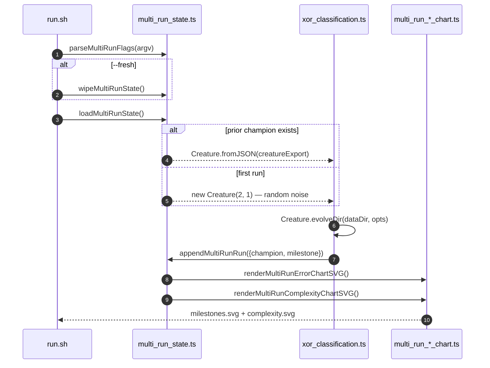

## Summary

Wires the `xor_classification` example into the multi-run persistence helper and aggregate-chart
pipeline (issues #318, #319, #320) so it follows the same idiom as `cart_pole`, `snake_game`, and
`maze_navigation`. Each invocation now resumes from the saved champion (when present), appends a
fresh milestone to the merged history, and re-renders both `milestones.svg` and `complexity.svg`.
The legacy single-run `evolution_summary.svg` artefact is removed; the decision-boundary SVG is
preserved (it is a different artefact). Closes #326.

## Evidence

XOR is a backend / CLI example with no web interface to screenshot. Verified via:

- New unit tests covering the resume code path, the `--fresh` wipe path, and the `--target-error`
  override path — all assert observable outputs (persisted milestones, run indices, written SVGs).
- A real `--fresh` run produced the committed
  [`docs/data/xor_classification/creature.json`](docs/data/xor_classification/creature.json),
  [`docs/data/xor_classification/milestones.json`](docs/data/xor_classification/milestones.json),
  and the multi-run charts ([`milestones.svg`](docs/screenshots/xor_classification/milestones.svg) /
  [`complexity.svg`](docs/screenshots/xor_classification/complexity.svg)). The run solved XOR in 39
  generations (`error=0.0078`, `fitness=0.9922`) starting from random noise.
- `./quality.sh` ran end-to-end; the `XOR Classification Example` section reports SUCCESS. The
  `XOR_QUICK=1` mode added to `quality.sh` (mirroring the cart-pole / snake / maze pattern) keeps CI
  invocations from churning the committed canonical artefacts.

The pre-existing `docs/archive_test.ts::No PR summary files remain in docs/ root` failure is present
on the base branch (verified via `git stash`), is unrelated to this change, and applies to every PR
added to `docs/` root.

## Test Plan

- [x] `runMultiRunXor resume flow loads prior creature, appends a milestone, and renders both charts`
      — pre-seeds multi-run state with a synthetic milestone, drives the runner with no flags,
      asserts the prior champion was reloaded (`outcome.resumed === true`), `nextRunIndex` advanced
      to 3, `cumulativeGen` is monotonic, and both chart SVGs were written under the `baseDir`
      override.
- [x] `runMultiRunXor --fresh wipes prior artefacts before running` — pre-seeds state, drives the
      runner with `--fresh`, asserts the wipe took effect (`outcome.resumed === false`,
      `outcome.runIndex === 1`).
- [x] `runMultiRunXor honours --target-error override via the persisted milestone` — drives the
      runner with `--target-error=0.9`, asserts the milestone's `error` sits at or under the
      override.
- [x] `evolveResultToMultiRunSample carries error/fitness/topology onto the milestone shape` — pure
      function test: feeds an `EvolveResult` and asserts the returned `NewMultiRunSample` carries
      every expected field.
- [x] `evolveXorController exposes finite seed and wall-clock fields on the result` — asserts the
      refreshed `EvolveResult` shape (replaces the old `EvolveDirSummary` round-trip test).
- [x] All 23 tests in `xor_classification/xor_classification_test.ts` pass.
- [x] `./quality.sh` reports `SUCCESS: XOR Classification Example` end-to-end.
