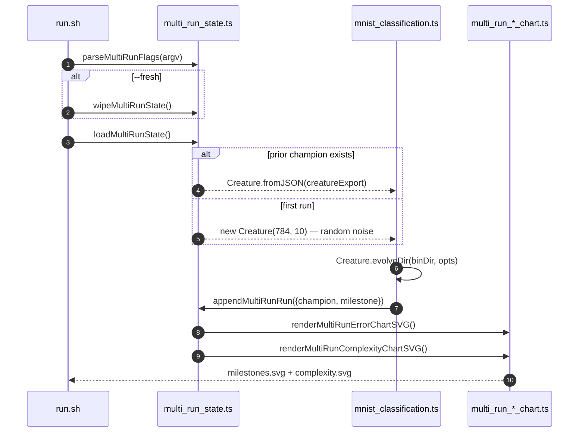

## Summary

Wires the `mnist_classification` example into the multi-run persistence helper and aggregate-chart
pipeline (issues #318, #319, #320) so it follows the same idiom as `xor_classification`,
`cart_pole`, `snake_game`, `maze_navigation`, `mountain_car`, and `lunar_lander`. Each invocation
now resumes from the saved champion (when present), appends a fresh milestone to the merged history,
and re-renders both `milestones.svg` and `complexity.svg`. The legacy single-run
`evolution_summary.svg` artefact (from #285) is retired and the README rewritten to describe the
multi-run idiom. Closes #327.

## Evidence

MNIST is a backend / CLI example with no web interface to screenshot. Verified via:

- New unit tests covering the resume code path, the `--fresh` wipe path, the `--target-error`
  override path, and the `--timeout` override path — all assert observable outputs (persisted
  milestones, run indices, written SVGs).
- A real `--fresh` run (5 m 15 s wall-clock, 94 generations completed before the 5-minute
  `timeoutMinutes` backstop fired) produced the committed
  [`docs/data/mnist_classification/creature.json`](docs/data/mnist_classification/creature.json),
  [`docs/data/mnist_classification/milestones.json`](docs/data/mnist_classification/milestones.json),
  the multi-run charts ([`milestones.svg`](docs/screenshots/mnist_classification/milestones.svg) /
  [`complexity.svg`](docs/screenshots/mnist_classification/complexity.svg)), and the regenerated
  prediction-grid screenshot. Test accuracy 6.96 %, validation accuracy 6.57 % — well below the
  random-noise baseline of 10 %, as expected for a 5-minute mutation-only run against full 28×28
  MNIST (the demo is the noise → competent arc, not a competent classifier).
- The full mnist test suite reports `35 passed | 0 failed (13s)`. The wider `common/` + mnist suite
  reports `145 passed | 0 failed (16s)`.
- `MNIST_QUICK=1` was added to `quality.sh` (mirroring the cart-pole / xor / snake / maze /
  mountain-car / lunar-lander pattern) so a full `./quality.sh` invocation no longer churns the
  committed canonical artefacts and finishes inside the per-section budget.

The pre-existing `docs/archive_test.ts::No PR summary files remain in docs/ root` failure is present
on the base branch (verified via `git stash`), is unrelated to this change, and applies to every PR
added to `docs/` root.

### Tests retired (with explicit documentation)

Two tests were retired because they exercised an artefact this PR explicitly retires (the legacy
single-run `EvolveDirSummary` SVG path) — the tests would no longer compile against the new code:

- `EVOLUTION_SUMMARY_SVG_PATH points at the example's docs/screenshots sub-directory` (constant
  removed; the multi-run chart pair replaces it).
- `evolveDir milestone SVG contains each numeric callout from the run summary` (chart renderer no
  longer invoked from MNIST).

The `README embeds the milestone SVG…` test was updated to assert on the new multi-run chart paths
and to forbid any reappearance of the retired `evolution_summary.svg` reference. The
`MnistRunSummary round-trip` test was updated to cover the two new fields the multi-run wiring adds
(`runIndex`, `resumed`). The change is documented in the test-file header comment.

## Test Plan

- [x] `runMultiRunMnist resume flow loads prior creature, appends a milestone, and renders both
      charts`
      — pre-seeds multi-run state with a synthetic milestone, drives the runner with no flags,
      asserts the prior champion was reloaded (`outcome.resumed === true`), `nextRunIndex` advanced
      to 3, `cumulativeGen` is monotonic, and both chart SVGs were written under the `baseDir`
      override.
- [x] `runMultiRunMnist --fresh wipes prior artefacts before running` — pre-seeds state, drives the
      runner with `--fresh`, asserts the wipe took effect (`outcome.resumed === false`,
      `outcome.runIndex === 1`).
- [x] `runMultiRunMnist honours --target-error override via the persisted milestone` — drives the
      runner with `--target-error=0.9`, asserts the override flowed through to the resolved options
      and the milestone was persisted.
- [x] `runMultiRunMnist --timeout override flows through to the resolved options` — drives the
      runner with `--timeout=7`, asserts the resolved options carry the override.
- [x] `evolveResultToMultiRunSample carries error/score/topology onto the milestone shape` — pure
      function test: feeds an `MnistEvolveResult` and asserts the returned `NewMultiRunSample`
      carries every expected field.
- [x] `evolveMnistClassifier exposes finite seed and wall-clock fields on the result` — asserts the
      refreshed `MnistEvolveResult` shape.
- [x] All 35 tests in `mnist_classification/mnist_classification_test.ts` pass.
