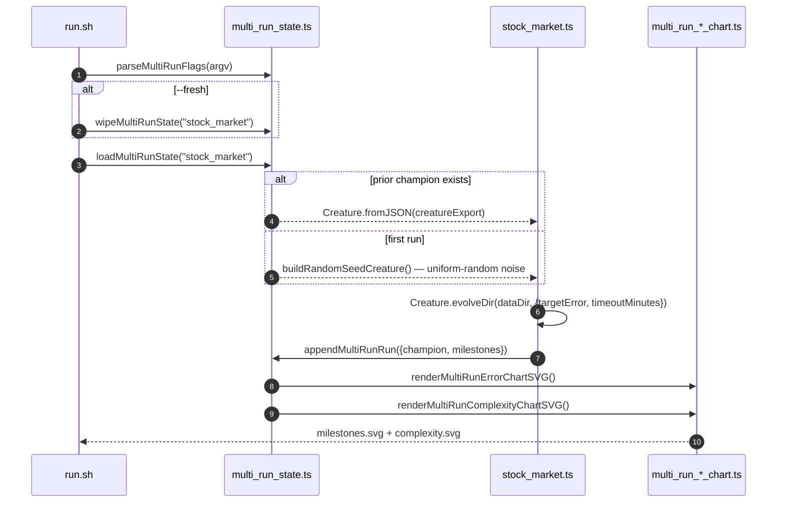

# PR Summary — Issue #328

## Summary

Wires the `stock_market` example into the multi-run persistence helpers (#318/#319/#320), mirroring
the pattern already adopted by `mnist_classification`, `cart_pole`, `xor_classification`,
`snake_game`, `maze_navigation`, `mountain_car`, and `lunar_lander`. The runner now resumes from the
saved champion when one exists, supports `--fresh` / `--timeout=<minutes>` /
`--target-error=<value>`, appends one `MultiRunMilestone` per run from `Creature.evolveDir`'s return
value, and emits the two cross-run charts (`milestones.svg` + `complexity.svg`). The legacy
single-run `evolution_summary.svg` (seeded under #301) is retired. Closes #328.

## Evidence

CLI / backend change — no UI to screenshot. The canonical artefacts come from a real ~5-minute
training run (`./stock_market/run.sh --fresh`, exit via `timeoutMinutes = 5`, 4 805 generations,
final error ≈ 0.2042, champion topology 65 neurons / 239 synapses).

Committed canonical artefacts:

- `docs/data/stock_market/creature.json` — persisted champion (resumes the next run)
- `docs/data/stock_market/milestones.json` — merged milestone history (one entry per run)
- `docs/screenshots/stock_market/milestones.svg` — multi-run error-curve chart
- `docs/screenshots/stock_market/complexity.svg` — multi-run complexity chart

## Test Plan

Tests added / modified in `stock_market/stock_market_test.ts`:

- `evolveStockController returns finite seed and wall-clock fields on the result` — covers the new
  flat result shape (replaces the legacy `EvolveDirSummary` assertions).
- `evolveResultToMultiRunSample carries error/score/topology onto the milestone shape` — verifies
  the new helper that projects `EvolveResult` onto `MultiRunMilestone`.
- `runMultiRunStock resume flow loads prior creature, appends a milestone, and renders both charts`
  — pre-seeds state with a synthetic prior champion + milestone, then asserts that
  `runMultiRunStock` reports `resumed: true`, `runIndex: 2`, monotonic `cumulativeGen`, and writes
  both chart SVGs (the resume-path test required by the issue).
- `runMultiRunStock --fresh wipes prior artefacts before running` — verifies the wipe semantics.
- `runMultiRunStock honours --target-error and --timeout overrides` — verifies CLI flag plumbing.
- `README embeds the multi-run charts and drops the legacy evolution_summary path` — guards the
  README content against drift.

The retired `EvolveDirSummary` SVG round-trip + `wallClockMs: NaN` rejection tests are no longer
relevant (the chart they exercised is gone). Their coverage is now provided by the resume / fresh /
override tests above, which exercise the same `Creature.evolveDir` return value via the multi-run
persistence path.

`./quality.sh` passes the `Stock Market` section under the new `STOCK_QUICK=1` quick mode (the
runner writes its artefacts under a temp directory so a CI invocation never overwrites the canonical
docs creature/milestones/charts). Unrelated pre-existing failures (snake_game WASM crashes, archived
PR-summary test) are unchanged by this PR.
