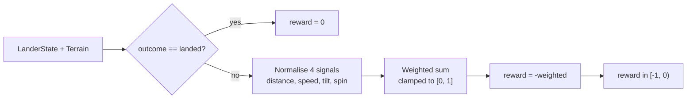

## Summary

Replaced the binary `0`/`-1` terminal reward in `LanderAdapter.step()` with a graded value in
`[-1, 0]` derived from four normalised terminal-step signals (pad distance, impact speed, tilt,
angular velocity), so the evolutionary search now has a smooth gradient between "crashed softly near
the pad" and "flew out of bounds at maximum speed" instead of a flat cliff. Closes #334.

A `landed` outcome still returns exactly `0` so `defaultRewardToError` keeps producing `error = 0`
for successful episodes, and every non-landed outcome returns a value in `[-1, 0)` formed from
`weight·clamp01(|signal|/upperBound)` contributions whose weights sum to `1`. The weights and upper
bounds live in a new exported `SCORE_NORMALISERS` constant so the choices are reviewable in one
place.

The historical `error = 1 - landedRate` identity is now an **upper bound** rather than an exact
identity (a landed rate of 50% can produce mean error well below 0.5 if non-landed crashes are
soft). `targetError = 0.01` therefore still guarantees a stop at **≥ 99% landed rate** in the worst
case and may stop earlier when crashes are graded mildly. JSDoc on `LanderAdapter` and
`evolveLanderController`, plus the `lunar_lander/README.md` section on stop conditions, were updated
to describe the new shape.

## Evidence

This is a pure-TS adapter change with no UI. The graded reward is verified by direct unit tests on
`gradedTerminalReward` and by an updated `LanderAdapter.step` test that asserts the terminal reward
stays inside `[-1, 0]`.



Test run (all 90 tests in `lunar_lander/` pass):

```
ok | 90 passed | 0 failed (316ms)
```

## Test Plan

- Updated `LanderAdapter.step emits zero reward until the terminal step` — asserts every
  non-terminal step emits `0`, the terminal step's reward sits in `[-1, 0]`, and a free-fall
  scenario produces a terminal reward strictly less than `0`.
- Added `gradedTerminalReward returns exactly 0 for a clean landing` — landed states return `0`.
- Added `gradedTerminalReward returns a value in [-1, 0) for every non-landed state` — sweeps a
  representative grid of non-landed states and asserts each reward stays in `[-1, 0)`.
- Added `gradedTerminalReward: softer crash > harder crash (less negative)` — covers the impact
  speed signal.
- Added `gradedTerminalReward: closer to pad > farther from pad` — covers the distance signal.
- Added `gradedTerminalReward: upright > tilted (less negative)` — covers the tilt signal.
- Added `gradedTerminalReward: non-spinning > spinning (less negative)` — covers the spin signal.
- Added `gradedTerminalReward respects [-1, 0] bounds across a state sweep` — exhaustive sweep well
  past the normaliser upper bounds; clamp keeps the result in `[-1, 0]`.
- Added `gradedTerminalReward handles out_of_bounds states (non-positive, bounded)` — covers the
  `out_of_bounds` classification branch.
- Added `SCORE_NORMALISERS weights sum to 1` — verifies the weighting invariant.
