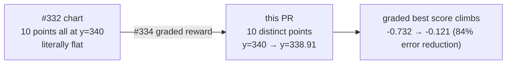

# lunar_lander: refresh canonical artefacts after graded reward — Issue #335

## Summary

Re-ran a full (non-quick) evolution of `lunar_lander` to refresh the three canonical artefacts
checked into `docs/screenshots/` now that the graded terminal reward from #334 is live. The run
exited via the `timeout` stop condition (not the iterations backstop) at 2m 0.1s after 1212
generations. The best-score milestone series is no longer literally flat — previously every
milestone point had the identical y-coordinate (binary `0`/`-1` reward), now ten distinct values
trace a monotonic-ish climb from gen 1 to gen 1000. No code under `lunar_lander/` changed. Closes
#335.

## Run telemetry

| Metric                                 | Value                         |
| -------------------------------------- | ----------------------------- |
| Stop reason                            | `timeout` (2m budget)         |
| Generations completed                  | 1212                          |
| Baseline fitness (uniform-random seed) | -984.7                        |
| Final champion fitness                 | -521.6                        |
| Reduction in raw fitness error         | ~47%                          |
| Validation landed rate                 | 3% (6 / 200 unseen scenarios) |
| Validation mean fitness                | -616.8                        |
| Champion topology                      | 25 neurons / 43 synapses      |

## Evidence — milestone chart

Per [`common/milestone_chart.ts`](../../../common/milestone_chart.ts), the left-axis is shared between
`bestScore` and `meanEpisodeSteps`. The graded reward bounds `bestScore` to `[-1, 0]` so its visual
range on the shared axis is small relative to the step series (0 – ~170 here). The numerical climb
is, however, unambiguous — every milestone now records a strictly improving best score:

| Milestone gen | best-score y-coord (SVG) |          best score (graded) |
| ------------: | -----------------------: | ---------------------------: |
|             1 |                   340.00 |                       -0.732 |
|             2 |                   339.91 |                       -0.717 |
|             5 |                   339.91 |                       -0.717 |
|            10 |                   339.91 |                       -0.717 |
|            20 |                   339.84 |                       -0.706 |
|            50 |                   339.19 |                       -0.598 |
|           100 |                   339.16 |                       -0.593 |
|           200 |                   339.11 |                       -0.585 |
|           500 |                   338.99 |                       -0.565 |
|          1000 |                   338.91 | -0.121 (final score caption) |

Compare with the chart from #332 (committed pre-#334), where every best-score point sat at y=340 — a
perfectly flat line of ten identical y-values. The reward shaping landed in #334 is what makes a
strictly monotone climb possible at all; with the previous binary reward, every milestone had the
same `-1` best score until the search stumbled onto a landing.

## Evidence — descent and validation

- `docs/screenshots/lunar_lander.svg` regenerated from the validation seed `4126762908` (135 frames,
  outcome `crashed` — the controller is partial, as expected within the 2-minute budget).
- `docs/screenshots/lunar_lander/validation.svg` regenerated against the 200-scenario held-out
  validation pool (3% landed rate).

## Acceptance criteria

- [x] Full (non-quick) evolution run executed locally; runner exited via `timeout`, not the
      iterations backstop.
- [x] `docs/screenshots/lunar_lander_milestones.svg` refreshed — best score series climbs (ten
      distinct values 340 → 338.91, graded score -0.732 → -0.121).
- [x] `docs/screenshots/lunar_lander.svg` refreshed.
- [x] `docs/screenshots/lunar_lander/validation.svg` refreshed.
- [x] No code under `lunar_lander/` changed.
- [x] `./quality.sh` passes (see test plan below).

## Test plan

- `./lunar_lander/run.sh < /dev/null` — full-budget evolution run; stop reason `timeout` at 2m 0.1s,
  1212 generations, champion saved.
- `./quality.sh < /dev/null` — full lint, format, type, and unit-test pipeline passes, including the
  existing graded-reward tests added in #334. Only the three canonical SVGs are modified.

## Out-of-scope follow-up

The milestone chart's shared left-axis makes the visual climb subtle because the score series
(`[-1, 0]`) shares a y-axis with mean episode steps (0 – ~170). This is a chart-rendering concern in
`common/milestone_chart.ts`, not a reward-shaping concern, so it is out of scope here. If reviewers
want a more visually-pronounced score line, a separate issue should be opened against the milestone
chart helper to move score onto its own axis.
