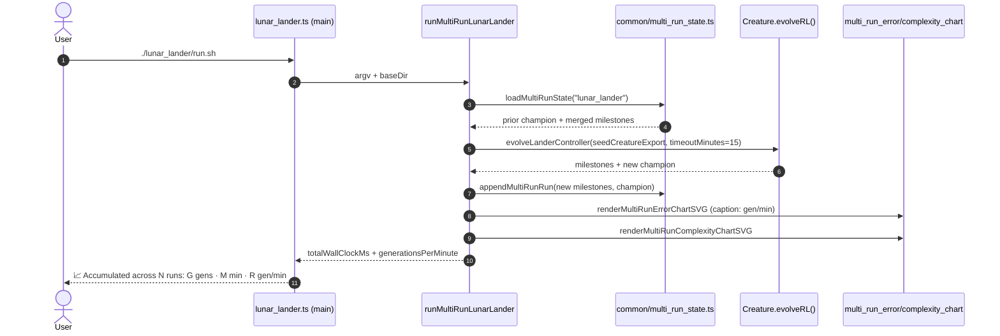

## Summary

Wire the lunar-lander example into the shared `common/multi_run_state.ts` resume flow so re-running
the example continues training from the prior champion, accumulates milestones across runs, and
surfaces the total wall-clock time plus a generations-per-minute throughput rate. The per-run
`timeoutMinutes` default is raised to **15 minutes** (issue #344's "at least another fifteen
minutes" ask), the multi-run error-chart caption now reports `gen/min` alongside total runs,
cumulative generations, and total wall-clock, and the CLI prints an `📈 Accumulated …` line after
each run. Fixes #344.

## Evidence



This is a CLI/library change with no UI surface, so screenshots are not produced. Behaviour is
verified by the new unit tests below; the runner is also exercised in CI via `LUNAR_QUICK=1` from
`quality.sh`.

## Test Plan

- `common/multi_run_error_chart_test.ts`:
  - **caption surfaces generations per minute (issue #344)** — drives the renderer with 60 gens over
    60 s of wall-clock and asserts the caption contains `60 gen/min`.
  - **caption gen/min handles zero total wall-clock** — defensive: a 0-ms total must not leak NaN /
    Infinity into the SVG.
- `lunar_lander/lunar_lander_test.ts`:
  - **multi-run constants live under the lunar_lander slug directory** — pins
    `EXAMPLE_SLUG = "lunar_lander"`, the two chart paths, and the new 15-minute default.
  - **milestoneToMultiRunSample maps the lunar adapter's bestScore to normalised error** — checks
    the `error = -bestScore` mapping that drives the merged-history charts.
  - **milestoneToMultiRunSample clamps error into [0, 1]** — defensive clamping for out-of-range
    `bestScore` values.
  - **evolveLanderController honours `seedCreatureExport`** — the controller accepts a prior
    champion as the evolveRL seed.
  - **runMultiRunLunarLander resume flow** — pre-seeds prior state under a temp `baseDir`, runs the
    multi-run flow with `iterations=1`, asserts the prior champion is reloaded, milestones are
    appended with monotonic `cumulativeGen`, the two chart SVGs are written, and the error chart
    caption surfaces `gen/min`.
  - **runMultiRunLunarLander --fresh wipes prior artefacts** — `--fresh` discards the prior state
    and starts from random noise.

Run locally with:

```bash
deno test --allow-read --allow-write --allow-env --allow-net \
  lunar_lander/lunar_lander_test.ts \
  common/multi_run_error_chart_test.ts < /dev/null
```
