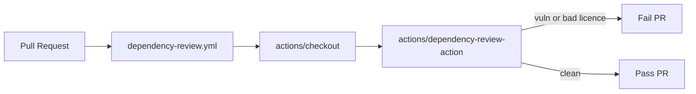

## Summary

Add the GitHub-maintained **Dependency Review** workflow so every pull request is scanned for
dependencies that introduce known vulnerabilities, invalid licences, or other supply-chain risks.
The action inspects the dependency graph diff between the base and head refs and fails the PR if a
problematic dependency is added.

Actions are pinned to 40-character commit SHAs (not floating tags) in line with the project's
supply-chain hardening rules.

Closes #35.

## Evidence

This is a CI-only change — no UI to screenshot. Behaviour is verified by unit tests that parse the
workflow YAML and assert on its configuration.

## Test Plan

- Added `.github/workflows/dependency_review_test.ts` with the following Deno tests:
  - workflow file exists and is valid YAML
  - workflow has a descriptive name
  - workflow triggers on `pull_request` events
  - workflow declares read-only `contents` permission
  - workflow defines at least one job
  - workflow checks out the repository
  - workflow invokes `actions/dependency-review-action`
  - every `uses:` step is pinned to a 40-character commit SHA
- Updated `docs/archive_test.ts` to whitelist `pr-summary-35.md` (this PR's summary) and
  `pr-summary-36.md` (already merged on Develop) so the archive sentinel test passes.
- `./quality.sh` runs lint, format check, all unit tests, and every example program.
