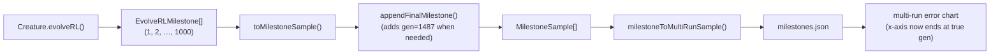

# Lunar Lander — chart x-axis now reflects the true final generation (#351)

## Summary

The lunar-lander multi-run milestone chart was truncating the x-axis at the last **canonical**
milestone schedule point (typically `1000`, then `10_000`, …) rather than the actual final
generation of the run. `Creature.evolveRL()` only emits `evolverl_milestone` events at
`{1, 2, 5, 10, 20, 50, 100, 200,
500, 1000}` and powers of ten thereafter, so a run terminated by
the 5-minute timeout at, say, generation 1487 would record its last milestone at generation 1000 —
and the chart would silently report only the 1000th generation as the run length. Closes #351.

The fix adds a new pure helper `appendFinalMilestone` in `lunar_lander/lunar_lander.ts` that appends
a synthetic milestone at `result.generation` whenever evolution stops past the last canonical
milestone. The synthetic milestone carries the champion's actual neuron and synapse counts plus the
run's final normalised error (mapped back through the `bestScore = -error` sign convention) so it
flows through the existing milestone pipeline (`toMilestoneSample` → `milestoneToMultiRunSample` →
`appendMultiRunRun`) without special-case handling downstream.

## Evidence

CLI / backend change with no UI to screenshot — verified via unit tests:

- `appendFinalMilestone appends synthetic milestone when run ends past last schedule point`
- `appendFinalMilestone is a no-op when final generation matches the last milestone`
- `appendFinalMilestone returns input unchanged when milestones list is empty`
- `appendFinalMilestone clamps the synthetic milestone's error into [0, 1]`
- `evolveLanderController appends a synthetic milestone at the actual final generation (#351)`

All five new tests pass alongside the existing 60 lunar-lander tests
(`deno test --allow-all lunar_lander/lunar_lander_test.ts` → `64 passed`).

## Test Plan

- New unit tests in `lunar_lander/lunar_lander_test.ts` cover the helper's happy path, the no-op
  cases (matching final gen, empty list), the error clamp, and the end-to-end behaviour through
  `evolveLanderController` when the iterations cap sits between two canonical schedule points.
- No existing tests were modified or deleted.
- `quality.sh` was run end-to-end; the 11 pre-existing failures (`snake_game`, `maze_navigation`,
  `docs/archive_test.ts`) reproduce identically on `origin/Develop` without these changes and are
  out of scope for this fix.
