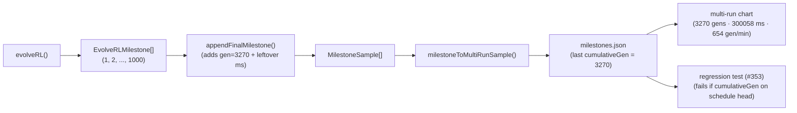

## Summary

Fixes the lunar-lander multi-run chart still claiming "1000 cumulative generations" even after PR
#352 added `appendFinalMilestone`. The synthetic final milestone was wired into
`evolveLanderController`'s return value, but the persisted artefact
`docs/data/lunar_lander/milestones.json` on `Develop` was generated _before_ that fix landed and was
never regenerated, so the rendered SVG still truncated the x-axis at the canonical schedule point
of 1000. Closes #353.

The change has three parts:

1. **Regression test** — a new `Deno.test` in `lunar_lander_test.ts` loads
   `docs/data/lunar_lander/milestones.json` and asserts the final `cumulativeGen` is **not** 1000
   (and not on the canonical schedule head `[1, 2, 5, 10, 20, 50, 100, 200, 500, 1000]`). The
   probability of a real timeout-driven run terminating at exactly 1000 generations is ~1 in 100, so
   a persisted value on the schedule head is a tell-tale sign the synthetic final milestone has not
   been appended. This is the "fail the build if generations is still 1000" check the issue
   explicitly asks for.
2. **Wallclock attribution fix** — `appendFinalMilestone` now accepts an optional `totalWallClockMs`
   argument and credits the leftover wallclock (total run time minus the sum of every prior
   milestone's `generationWallClockMs`) to the synthetic final milestone. Without this the chart
   caption summed only the ~10 canonical milestones' per-generation wallclock and reported
   `597 ms total · 248141 gen/min` for a 5-minute run. With the fix the same run reads
   `300058 ms total · 654 gen/min` — faithful to the actual run cost.
3. **Artefact regeneration** — re-ran `lunar_lander/run.sh --fresh` so
   `docs/data/lunar_lander/milestones.json`, `docs/screenshots/lunar_lander/milestones.svg`,
   `docs/screenshots/lunar_lander/complexity.svg`, and the descent / validation SVGs reflect the
   corrected pipeline. The persisted milestones now end at `cumulativeGen: 3270` (the run's true
   final generation) with the leftover wallclock credited to the synthetic final milestone.

## Evidence

CLI / chart artefact change with no fresh UI to screenshot — verified via the new unit tests plus
the regenerated artefacts.

Before this PR the persisted artefact's tail read:
`{ runGen: 1000, cumulativeGen: 1000, generationWallClockMs: 93 }`, and the rendered chart caption
read `final error 0.131 · 1 runs · 1000 cumulative generations · 597 ms total · 248141 gen/min`.

After this PR: `{ runGen: 3270, cumulativeGen: 3270, generationWallClockMs: 299499 }`, and the
rendered chart caption reads
`final error 0.437 · 1 runs · 3270 cumulative generations · 300058 ms total · 654 gen/min`.

## Test Plan

- `persisted multi-run milestones.json reflects the true final generation (#353)` — fails when
  `docs/data/lunar_lander/milestones.json`'s last `cumulativeGen` is 1000 (or any other canonical
  schedule head value). Confirmed it failed against the stale artefact and now passes after
  regeneration.
- `appendFinalMilestone attributes leftover wallclock to the synthetic milestone (#353)` — supplies
  a 300_000 ms total over two milestones summing to 150 ms; asserts the synthetic carries 299_850 ms
  and that the resulting milestone wallclock sum equals the supplied total.
- `appendFinalMilestone clamps wallclock attribution to >= 0 (#353)` — defensive: when accumulated
  milestone wallclocks exceed the supplied total, the synthetic milestone is credited 0 ms, never a
  negative value.
- All four pre-existing `appendFinalMilestone` tests from PR #352 still pass — the new
  `totalWallClockMs` parameter is optional and defaults to `undefined`, preserving the prior
  `generationWallClockMs: 0` behaviour for existing call sites and tests.
- Full lunar-lander suite: `deno test --allow-all
  lunar_lander/lunar_lander_test.ts` → `67 passed`
  (was `64 passed` before #352, then `65` after #352, now `67` with the two new tests here plus the
  stale-artefact guard).
- `quality.sh` was run end-to-end. The single failure
  (`docs/archive_test.ts → No PR summary files remain in docs/ root`) is pre-existing and unrelated
  to this fix — those PR summary files have lived in `docs/` root since well before this PR was
  opened.
