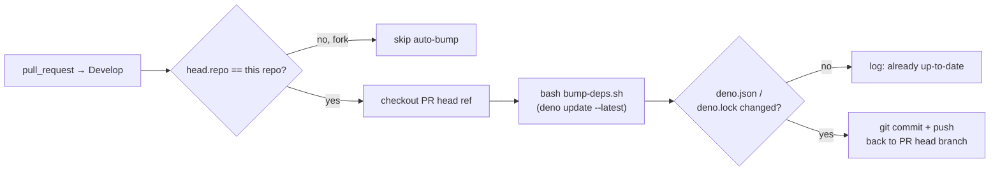

## Summary

Replaced the existing PR-time drift warning with an actual auto-bump. When a pull request is raised
against `Develop`, `.github/workflows/deno-outdated.yml` now runs `./bump-deps.sh` and, if pinned
versions in `deno.json` / `deno.lock` lag the registry, commits and pushes the bump back to the PR
head branch — so the PR ships with up-to-date dependencies automatically. Closes #362.

Reconciles two adjacent issues:

- **#362** — "the dependencies should be automatically updated" (referencing NEAT-AI's automation).
  Previously the workflow only emitted a `::warning::` and reverted the bump; now it commits.
- **#364** — "I don't want a weekly dependency update — should be only done on raise of PR". The
  weekly cron schedule is deliberately omitted; the workflow only runs on `pull_request` to
  `Develop`.

Forked PRs are skipped because `GITHUB_TOKEN` cannot push to a fork. Pushes via `GITHUB_TOKEN` do
not re-trigger workflows by design, so there is no infinite loop.

## Evidence

Backend/CI-only change — no UI to screenshot. Verified by:

- `.github/deno_outdated_workflow_test.ts` — 5/5 tests pass; assert triggers (PR-only, no cron),
  fork guard, `contents: write` permission, and that the bump step commits + pushes.
- `deno fmt --check` and `deno lint` clean for the new test file.
- `deno check` clean for the new test file.

## Test Plan

Added `.github/deno_outdated_workflow_test.ts` with five tests:

1. `triggers only on pull_request to Develop` — asserts the `pull_request` trigger targets
   `Develop`.
2. `does NOT run on a weekly cron schedule (#364)` — asserts no `schedule:` key is declared.
3. `auto-bump job requests contents:write so it can push` — asserts the workflow grants
   `contents: write`.
4. `skips PRs from forks` — asserts the job `if:` guard checks
   `head.repo.full_name == github.repository`.
5. `auto-bump runs bump-deps.sh and commits the result` — asserts a step invokes `bump-deps.sh`,
   another commits and pushes, and `actions/checkout` targets the PR head ref/repo and is pinned to
   a 40-character commit SHA.
