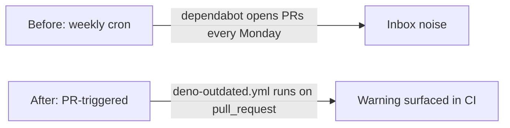

## Summary

Removed the weekly Dependabot schedule for GitHub Actions. Dependency freshness is now only surfaced
when a pull request is raised, via the existing `.github/workflows/deno-outdated.yml` job which runs
`./bump-deps.sh` on `pull_request` and warns if pins lag the registry. No more weekly bot PRs
hitting the inbox. Closes #364.

## Evidence

Backend/config-only change — no UI to screenshot.

- Deleted file: `.github/dependabot.yml` (was scheduled `weekly`).
- Retained file: `.github/workflows/deno-outdated.yml` already triggers on `pull_request` →
  `Develop`, satisfying the "only on raise of PR" requirement.
- `deno fmt --check` and `deno lint` pass after the change.
- No other repo file references `dependabot` outside `docs/archive/` (verified by repo-wide grep).

## Test Plan

- [x] `deno fmt --check` clean.
- [x] `deno lint` clean.
- [x] Confirmed `.github/workflows/deno-outdated.yml` still runs on `pull_request` to provide
      PR-time freshness signal.
- [x] Confirmed no remaining references to `dependabot` in tracked source (excluding archived PR
      summaries).
