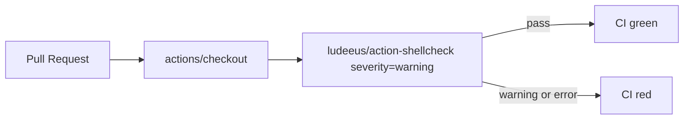

## Summary

Adds a ShellCheck Lint GitHub Actions workflow that runs on every pull request, linting all shell
scripts in the repository (`quality.sh` and the per-example `run.sh` scripts). The workflow uses the
`ludeeus/action-shellcheck` action pinned to a 40-character commit SHA (v2.0.0), with
`severity: warning` so style suggestions do not fail the build but real warnings and errors do.
Closes #37.

## Evidence

This change is a CI configuration only — there is no UI to screenshot. Verification was done by:

- Running `shellcheck --severity=warning` locally against every `*.sh` file in the repository — all
  pass cleanly.
- TDD: adding `.github/workflows/shellcheck_test.ts` with 9 tests that parse the workflow YAML and
  assert on its structure (name, triggers, permissions, jobs, checkout step, shellcheck invocation,
  SHA pinning, and severity configuration). Tests fail without the workflow file and pass once it is
  added.

## Test Plan

- Added `.github/workflows/shellcheck_test.ts` (9 tests):
  - workflow file exists and is valid YAML
  - has a descriptive name
  - triggers on `pull_request` events
  - declares read-only `contents` permission
  - defines a shellcheck job
  - checks out the repository
  - runs shellcheck (via `ludeeus/action-shellcheck` or CLI)
  - pins all third-party actions to 40-character commit SHAs
  - configures `severity` at `warning` or stricter
- Updated `docs/archive_test.ts` to allowlist `pr-summary-37.md`.
- Existing `quality.sh` and `*/run.sh` scripts already pass `shellcheck --severity=warning`, so the
  new workflow will be green from the first run.
