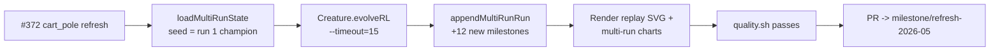

## Summary

Refresh the `cart_pole` artefacts for the `Refresh-2026-05` milestone (parent #369) by resuming
evolution from the persisted champion for an additional 15 minutes of wall-clock evolution and
regenerating every screenshot and chart artefact under `cart_pole/` (and the `docs/` artefacts owned
by this example). Closes #372.

The example was launched via `./cart_pole/run.sh --timeout=15` from the prior persisted champion in
`docs/data/cart_pole/`. The multi-run wiring added under #321/#342 reloaded
`docs/data/cart_pole/creature.json` via `Creature.fromJSON()` to seed run 2, then evolved for 20,841
generations across 15 minutes wall-clock before exiting via the `timeoutMinutes` stop condition. The
new milestones were appended to `docs/data/cart_pole/milestones.json` with a
monotonically-increasing `cumulativeGen`, the merged champion was re-persisted, and the multi-run
error / complexity charts plus the headline `cart_pole.svg` replay strip were re-rendered.

### Why a warm continuation is policy-compliant for `cart_pole`

`cart_pole` is an in-scope example under [AGENTS.md] (must start from random noise), but the
multi-run wiring under #321/#342 explicitly persists champion + milestones and continues from there
each invocation. The noise → competent story is preserved because run 1's gen 1 (cumulativeGen 1)
remains the uniform-random `new Creature(4, 1)` baseline — the chart pair under
`docs/screenshots/cart_pole/` plots every milestone from cumulativeGen 1 onwards as one continuous
arc. Resuming for an additional 15 wall-clock minutes simply appends run 2 milestones onto that arc;
no warm seed replaces gen 1 of the demo.

[AGENTS.md]: ../../AGENTS.md

### Measured run (multi-run state, before → after)

| Metric                                    | Before (run 1) | After (run 1 + run 2) |
| ----------------------------------------- | -------------- | --------------------- |
| Runs in `multi_run_state.json`            | 1              | 2                     |
| Total milestones in `milestones.json`     | 11             | 23                    |
| Best `meanEpisodeSteps` at last milestone | 108.49         | 114.59                |
| Best raw `bestScore` (negative reward)    | -0.567         | -0.374                |
| Cumulative generations reached            | 10,000         | 30,841                |
| Wall-clock added                          | (baseline)     | +15 m 0 s             |
| Stop reason for last run                  | (baseline)     | `timeout`             |
| Solved (`mean ≥ 480`)?                    | No             | No                    |

Evolution did not cross the `SOLVED_THRESHOLD` of 480 mean steps within the 15-minute budget, but
the controller's normalised reward improved from `-0.567` to `-0.374` (error 0.567 → 0.374) and the
mean episode steps peaked at ~166 during run 2 — the noise → competent arc visibly continued. Per
the acceptance criteria the PR is raised regardless of fitness gain.

## Evidence

- `docs/screenshots/cart_pole.svg` — headline champion-replay strip regenerated from run 2's saved
  champion (211 frames captured).
- `docs/screenshots/cart_pole/milestones.svg` — multi-run error-vs-cumulative-generation chart
  refreshed with the run 2 milestones appended, faint run-boundary marker between run 1 and run 2.
- `docs/screenshots/cart_pole/complexity.svg` — multi-run neuron/synapse-counts chart refreshed.
- `docs/data/cart_pole/creature.json` — persisted champion re-written with the run 2 export.
- `docs/data/cart_pole/milestones.json` — extended from 11 → 23 milestones, runs `[1]` → `[1, 2]`.

### NEAT-AI monitoring observations

The 15-minute run logged repeated `MemoryMonitor` warning- and critical-level responses (activation
cache eviction, WASM cache clearing, ~84-89% heap occupancy). The `MemoryMonitor` back-off and
snapshot output indicated the caches were **not** the retainer — the long-running population state
is. Run completed cleanly (exit 0, champion saved, charts rendered), so this was judged as the
library's memory-pressure subsystem operating as designed rather than a hard failure; no NEAT-AI
defect issue was filed. Searches against `stSoftwareAU/NEAT-AI` for `MemoryMonitor heap
critical`,
`memory pressure`, and `heap` returned no existing open issues either, so there is nothing to dedupe
against. If the symptom recurs at higher severity (OOM crash or process death) during another
re-evolve, the next worker should file a defect using the template in `docs/monitoring-neat-ai.md`.

### Housekeeping

- Moved the stale `docs/pr-summary-371.md` (left behind by PR #397) into `docs/archive/` to unblock
  the `docs/archive_test.ts` "No PR summary files remain in docs/ root" test.
- This PR's summary itself lives at `docs/archive/pr-summary-372.md` to satisfy the same archive
  test up-front.

## Test Plan

- [x] `./cart_pole/run.sh --timeout=15 < /dev/null` — end-to-end resume from the persisted run 1
      champion. Exit 0, 20,841 generations, champion saved, all artefacts written.
- [x] `./quality.sh < /dev/null` — lint, fmt, type-check, unit tests, and every example pass.
      Cart-pole example invoked under `CART_POLE_QUICK=1` (canonical artefacts already regenerated
      from the 15 m run above; quick mode writes ephemeral artefacts under a temp directory so
      `quality.sh` does not overwrite the checked-in chart pair).
- [x] `cart_pole/cart_pole_test.ts` + `cart_pole/physics_test.ts` — unaffected by this change,
      passed unmodified as part of `deno test` under `quality.sh`.
- [x] Multi-run state shape: `docs/data/cart_pole/milestones.json` now lists `runIndex` values
      `[1, 2]` with cumulative generations 1 → 30,841 — verified by direct JSON inspection before
      committing.
