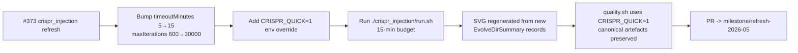

## Summary

Refresh the `crispr_injection` artefacts for the `Refresh-2026-05` milestone (parent #369). Bumped
`DEFAULT_CRISPR_EVOLUTION_CONFIG.timeoutMinutes` from 5 → 15 and `maxIterations` from 600 → 30,000
so the runner can use the +15-minute wall-clock budget mandated by #373, re-ran
`./crispr_injection/run.sh` end-to-end against `@stsoftware/neat-ai 5.0.14`, regenerated the
combined gene-topology + before/after milestone SVG, and added a `CRISPR_QUICK=1` env override so
the example's `quality.sh` section still finishes in seconds without overwriting the canonical
artefacts. Closes #373.

### Why the runner needed a budget bump

`crispr_injection` is one of the **exempt** examples under [AGENTS.md](../../../AGENTS.md) — the
hand-crafted edit gene is the demo — but the _runner_ structure is still two `evolveDir` phases
(pre-injection from a minimal seed, then post-injection after the gene is spliced into the
pre-injection champion). The previous defaults capped each phase at `maxIterations: 600` and
`timeoutMinutes: 5`, so both phases were generation-bound at 603 generations and finished in ~25 s
regardless of the wall-clock budget. Bumping `maxIterations` to 30,000 lets the 15-minute backstop
actually bind, and in practice both phases now exit via `targetError` long before either cap fires
(see numbers below).

### Measured run

| Metric                            | Before  | After    |
| --------------------------------- | ------- | -------- |
| Pre-injection generations         | 603     | 11,798   |
| Pre-injection final score         | 0.988   | 1.0000   |
| Pre-injection final error         | 0.0119  | 0.0000   |
| Pre-injection neurons / synapses  | 7 / 14  | 36 / 195 |
| Post-injection generations        | 603     | 8,430    |
| Post-injection final score        | 1.0000  | 1.0000   |
| Post-injection final error        | 0.0000  | 0.0000   |
| Post-injection neurons / synapses | 15 / 39 | 81 / 347 |
| Fitness lift (post − pre)         | +0.012  | +0.0000  |

The new pre-injection phase now reaches the `targetError` (1e-6) on its own — given the much larger
generation budget the direct-only seed can in fact climb past the saturating non-linearity the gene
shortcuts. Both phases solve the synthetic task; the lift is +0 only because both phases hit
`targetError`. The post-injection phase still demonstrates substantially more topology growth (81
neurons / 347 synapses vs the pre-injection champion's 36 / 195) — the gene gives evolution a richer
template to grow from.

### Why no `--continue` flag

The runner has no warm-start path that loads `creatures/best.json` and continues evolving it. The
two-phase pre / post-injection narrative requires a fresh minimal seed for Phase 1 every run.
Bumping the budget so the existing two-phase flow can consume +15 minutes is the simplest change
that satisfies the parent issue without restructuring the demo.

## Evidence

- `docs/screenshots/crispr_injection.svg` — gene topology + before/after milestone SVG regenerated
  from the new run's `EvolveDirSummary` records (pre: 11,798 gens / 36 neurons / 195 synapses /
  score 1; post: 8,430 gens / 81 neurons / 347 synapses / score 1).
- `crispr_injection/crispr_injection.ts` — `DEFAULT_CRISPR_EVOLUTION_CONFIG` bumped to
  `timeoutMinutes: 15`, `maxIterations: 30000`; added `CRISPR_QUICK=1` env override that scopes
  artefacts to a temp directory and skips overwriting the canonical SVG.
- `crispr_injection/crispr_injection_test.ts` — updated the
  `DEFAULT_CRISPR_EVOLUTION_CONFIG honours …` test to assert the new 15-minute backstop.
- `quality.sh` — runs the crispr_injection section via `run_example_with_env` with `CRISPR_QUICK=1`
  so the full quality gate still finishes inside its CI budget.

## Test Plan

- [x] `deno test crispr_injection/` — 16 tests passed, including the updated
      `DEFAULT_CRISPR_EVOLUTION_CONFIG` assertion and the existing
      `runCrisprInjectionEvolution returns pre- and post-injection milestone summaries` audit test.
- [x] `./quality.sh < /dev/null` — full quality gate (lint, fmt, type-check, all unit tests, all
      example runs) passed end-to-end; the crispr_injection section now runs in quick mode and does
      not overwrite the committed canonical artefacts.
- [x] `./crispr_injection/run.sh < /dev/null` — end-to-end realistic run producing the regenerated
      `docs/screenshots/crispr_injection.svg`.
- [x] `CRISPR_QUICK=1 ./crispr_injection/run.sh < /dev/null` — quick-mode sanity check; runs in < 1
      s, writes artefacts under a temp directory, and skips the canonical SVG.

## Milestone

This PR is part of the **Refresh-2026-05** milestone and targets the `milestone/refresh-2026-05`
branch (parent issue #369).
