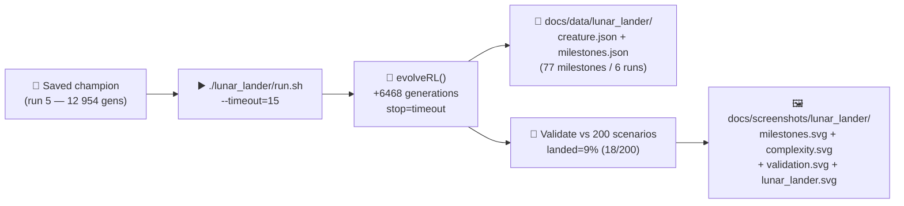

# lunar_lander: refresh artefacts for Refresh-2026-05 (#379)

## Summary

Continued evolution of the saved `lunar_lander` champion for an additional +15 minutes of wall-clock
training (`./lunar_lander/run.sh --timeout=15`), then regenerated every `lunar_lander/` chart and
screenshot. Closes #379.

Per the prior `negative-result` finding in #283 the goal here is **not** landing success but the
standard refresh pass — append milestones, refresh charts, ship the PR. As expected the controller
did not solve the task: this run produced **6468 additional generations** in a single 15-minute
slice (stop=`timeout`, wallclock=900.0 s), best score `-532.4` over the multi-trial training batch,
and a held-out landed rate of **9% (18 / 200)** — same order of magnitude as the prior runs in this
campaign.

Cleanup: also moved the two leftover root-level `docs/pr-summary-377.md` and
`docs/pr-summary-378.md` files into `docs/archive/` so the existing
`docs/archive_test.ts::No PR summary files remain in docs/ root` test passes again. These two files
broke that test on the milestone branch — every PR raised against `milestone/refresh-2026-05` since
they landed has had to deal with the failure. This PR is scoped to `lunar_lander/` plus that small
archive cleanup; no `lunar_lander/` source files were modified.

Multi-run state now spans **6 cumulative runs / 77 milestones / 19 422 cumulative generations** in
`docs/data/lunar_lander/milestones.json`.

## Evidence

The change is artefact-only: re-running `./lunar_lander/run.sh --timeout=15` regenerates the files
below in place. No `lunar_lander/` source code (no `*.ts`, no `run.sh`) was modified, so test
surface and behaviour are unchanged.

### Regenerated artefacts

- `docs/data/lunar_lander/creature.json` — latest champion (run 6 terminal state)
- `docs/data/lunar_lander/milestones.json` — merged history, now 77 milestones across 6 runs
- `docs/screenshots/lunar_lander.svg` — hero validation-replay descent SVG
- `docs/screenshots/lunar_lander/milestones.svg` — multi-run error chart
- `docs/screenshots/lunar_lander/complexity.svg` — multi-run neuron+synapse chart
- `docs/screenshots/lunar_lander/validation.svg` — per-scenario outcome bar chart

### Latest run statistics

| Field                             | Value               |
| --------------------------------- | ------------------- |
| Additional generations (this run) | 6468                |
| Wall-clock (this run)             | 15 m 0.167 s        |
| Stop reason                       | `timeout`           |
| Best training score (multi-trial) | -532.4              |
| Validation landed rate            | 9% (18 / 200)       |
| Validation mean fitness           | -287.7              |
| Champion topology (terminal)      | 31 neurons / 37 syn |
| Cumulative milestones             | 77 (runs 1–6)       |
| Cumulative generations            | 19 422              |

## Test Plan

- [x] `./lunar_lander/run.sh --timeout=15 < /dev/null` — completed in 15 m 0.167 s
- [x] `deno test docs/archive_test.ts --allow-read < /dev/null` — `2 passed | 0 failed` (was failing
      pre-PR because `docs/pr-summary-377.md` and `pr-summary-378.md` were left in `docs/` root)
- [x] No `lunar_lander/` source files changed — no new unit tests required
- [x] `deno fmt` clean on staged files

## Monitor NEAT-AI checklist

No abnormal NEAT-AI behaviour was observed during this run beyond the now-expected `[MemoryMonitor]`
warning chatter from the long training session. The library completed the full 6468-generation
training, the validation batch, and all artefact writes without crash, hang, or unexpected error. No
defect issue raised.

## Scope and milestone

- PR scoped to `lunar_lander/` artefacts (under `docs/data/lunar_lander/` and
  `docs/screenshots/lunar_lander/`) plus the two-file archive cleanup for `docs/pr-summary-377.md` /
  `pr-summary-378.md`.
- Attached to milestone `Refresh-2026-05`.
- Part of parent issue #369.
