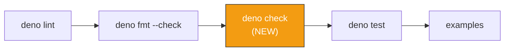

## Summary

Adds the missing **Deno type-check** capability to the project quality gate. Closes #38.

The CI workflow (`.github/workflows/quality.yml`) and local `quality.sh` now run
`deno check **/*.ts` between formatting and unit tests so type errors are caught before code is
executed. Adding `deno check` exposed several real type mismatches that the existing
`deno test --no-check` pipeline had hidden:

- `console`, `performance`, `structuredClone`, and `globalThis` were not in scope because
  `deno.json` set `lib` to only `deno.ns` / `deno.unstable`. Added `deno.window` and `esnext` to the
  `lib` array.
- `Creature.fromJSON` accepts both `CreatureExport` (UUID-based) and `CreatureInternal` (index-based
  with `from`/`to`). The examples construct the index-based form, but `CreatureInternal` is not
  exported from `@stsoftware/neat-ai`. Introduced a local `LegacyCreatureJSON` type in
  `common/legacy_types.ts` that mirrors the index-based shape, plus a small `asCreatureExport`
  helper that performs the boundary cast at the single point where the library is invoked.
- `discoveryTimeOutMinutes` was renamed to `discoveryRecordTimeOutMinutes` in the library;
  `discoveryMinImprovementPercentage` was renamed to
  `discoveryMinImprovementVsCostOfGrowthMultiplier`; the `discoveryDisable*Candidates` options no
  longer exist. Updated `discovery/discover_missing_neuron.ts` to use the current `NeatOptions`.
- README updated: pipeline diagram now includes the type-check step and the Linting / Formatting
  collapsible section documents `deno check`.

## Evidence

This is a CLI / CI configuration change — there is no UI to screenshot. Verified by running:

```bash
./quality.sh < /dev/null   # passes lint, fmt, deno check, tests, and all examples
deno check **/*.ts         # exits 0 with no type errors
```



## Test Plan

- Added `workflow runs deno check (type checking)` to `.github/workflows/quality_test.ts` — asserts
  the workflow YAML contains a step running `deno check`.
- Added `quality.sh runs deno check (type checking)` and
  `quality.sh runs type check before unit tests` to `lint_fmt_config_test.ts`.
- Existing tests for lint, fmt, unit tests, and example runners continue to pass unchanged (171
  tests total).
