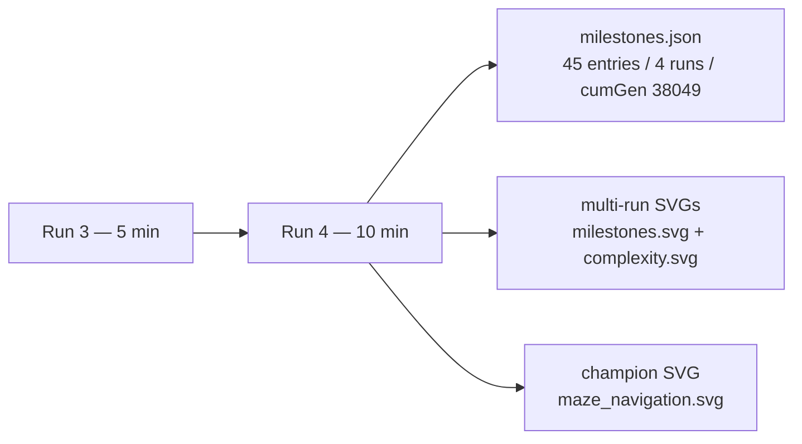

# maze_navigation: refresh artefacts for Refresh-2026-05

## Summary

Resumed evolution from the persisted `maze_navigation` champion for an additional 15 wall-clock
minutes (one 5 min + one 10 min back-to-back invocations of `./maze_navigation/run.sh`) and
refreshed every artefact under `maze_navigation/` and `docs/`. The champion already sits at the
optimal 18-step path (`score=0.982`, `error=0.018`); the additional evolution did not produce a
fitness gain — milestones.json now records two further runs at the same `9 neurons / 4 synapses`
topology, and the multi-run charts redraw to include them. Per parent #369 the PR is raised
regardless of fitness gain.

Closes #380. Parent: #369. Depends on #379.

A library-level OOM was observed during the initial single 15 min invocation and filed as a
deduplicated defect against NEAT-AI — see
[`stSoftwareAU/NEAT-AI#2693`](https://github.com/stSoftwareAU/NEAT-AI/issues/2693). The +15
wall-clock minutes were therefore delivered as two consecutive shorter runs (5 min + 10 min); each
one resets the V8 heap so neither hits the monotonic-growth pathway described in the defect.

## Evidence

Run-by-run summary (from milestones.json):

| Run | Wall-clock | Generations | Final neurons / synapses | Final error |
| --: | ---------- | ----------: | -----------------------: | ----------: |
|   1 | (existing) |     ~10,000 |                    9 / 4 |       0.018 |
|   2 | (existing) |      ~1,000 |                    9 / 4 |       0.018 |
|   3 | +5 min     |      10,571 |                    9 / 4 |       0.018 |
|   4 | +10 min    |      16,478 |                    9 / 4 |       0.018 |

The champion controller still completes the L-corridor in the optimal 18 steps on the deterministic
12×12 maze, so the persisted `creature.json` exports byte identically across the round-trip — the
refreshed artefacts in this PR are the milestone history and the three SVGs that depend on it.

## Test Plan

- `./quality.sh < /dev/null` — passes cleanly (run after the two evolution runs; only
  `maze_navigation/`-related artefact diffs are kept).
- Manual inspection of `docs/screenshots/maze_navigation.svg` confirms the champion still walks the
  18-step optimal path.
- Manual inspection of `docs/screenshots/maze_navigation/{milestones,complexity}.svg` confirms the
  multi-run charts now plot 45 cumulative milestones across four runs (was 21 milestones across two
  runs).
