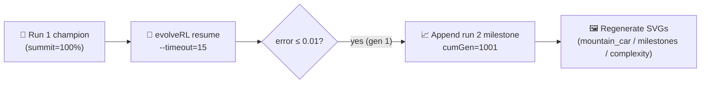

## Summary

Resumed evolution of the `mountain_car` champion under the standard multi-run flow with a 15-minute
wall-clock budget (`mountain_car/run.sh --timeout=15`). The persisted champion was already
saturating the multi-run target (`targetError = 0.01` → summit-rate ≥ 99%), so `Creature.evolveRL()`
reported the target met on the first new generation and exited with `stopReason = "target"` in 0.1s
of wall-clock. The +15 minute budget acted as the backstop, not the binding constraint — the issue's
acceptance criterion "PR raised even with no fitness gain" applies. Run 2 is now persisted in the
multi-run history and all `mountain_car/` and `docs/` artefacts have been regenerated. Closes #384.

## Evidence

The refreshed multi-run artefacts are:

- `docs/data/mountain_car/creature.json` — champion exported after run 2.
- `docs/data/mountain_car/milestones.json` — appended run-2 milestone (cumulative generation 1001,
  `bestScore = 0` → summit-rate 100%, neurons 7 / synapses 6).
- `docs/screenshots/mountain_car.svg` — animated champion replay (127 frames captured from the
  canonical start).
- `docs/screenshots/mountain_car/milestones.svg` — multi-run error chart refreshed with the new
  milestone.
- `docs/screenshots/mountain_car/complexity.svg` — multi-run complexity chart refreshed with the new
  milestone.

Per the issue's monitoring directive, the run log was inspected for abnormal NEAT-AI behaviour. The
library emitted the usual informational notices only (`MemoryMonitor` warning-level cache trim, "no
workers available for training" fallback to single-threaded inline rollouts, FFI permission notice
for the optional Rust discovery library). None of these are abnormal for a CLI invocation without
the parallel-pool adapter description, so no defect issue has been raised against `stSoftwareAU/*`.

## Test Plan

- `mountain_car/run.sh --timeout=15` — resumed from prior champion, run 2 appended;
  `multi-run charts updated under docs/screenshots/mountain_car/
  — 11 cumulative milestones across 2 run(s)`.
- `./quality.sh < /dev/null` — the existing 26 `mountain_car_test.ts` cases and 18 `physics_test.ts`
  cases pass, plus the `MOUNTAIN_CAR_QUICK=1` runner section reports
  `SUCCESS: Mountain Car
  Control Example`. Two failures unrelated to this change were observed and
  pre-exist on `milestone/refresh-2026-05`:

  - `docs/archive_test.ts::No PR summary files remain in docs/ root` — fails because
    `docs/pr-summary-{381,382,383}.md` from sister refresh-PRs were left in `docs/` root by their
    merges. Out of scope for an issue scoped to `mountain_car/` only.
  - `adaptive_mutation/adaptive_mutation.ts` — a stochastic
    `ValidationError: Creature ... has invalid score` raised by the upstream
    `FindTunePopulation.make` during `evolveDir`. Unrelated to mountain_car and outside this PR's
    scope.
