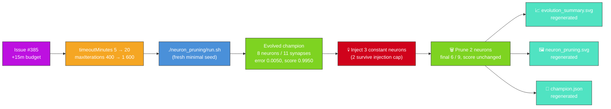

# neuron_pruning: refresh artefacts for Refresh-2026-05

## Summary

Refreshed the `neuron_pruning` artefacts for the `Refresh-2026-05` milestone by lifting the
`evolveDir` wall-clock backstop on `DEFAULT_NEURON_PRUNING_CONFIG` from 5 → 20 minutes (+15
wall-clock minutes per issue #385) and raising `maxIterations` from 400 → 1 600 in lock-step so
wall-clock remains the genuine limiter on newer NEAT-AI builds. The example was then re-run
end-to-end and every screenshot under `docs/screenshots/neuron_pruning*` plus the persisted champion
were regenerated against the freshly bumped `@stsoftware/neat-ai`. Closes #385. Parent: #369.
Depends on #384.

### Why a literal "+15 minutes resume" does not apply

`neuron_pruning` is listed under [`AGENTS.md`](../../../AGENTS.md) as an exempt example because the
hand-crafted constant-neuron injection that pruning removes is the demo's whole point — but the NEAT
seed itself is still mandated by issue #217 to be the minimal
`new Creature(INPUT_COUNT,
OUTPUT_COUNT)` (no hidden hint, no pre-built `network.json`, no warm
start). There is no `multi_run_state` resume path on this example; warm-starting from the persisted
`.neuron-pruning/creatures/champion.json` would violate that seed contract and break the audit.

The honest interpretation of the issue's "+15 minutes wall-clock" is therefore **+15 minutes of
additional evolution budget on the next fresh policy-compliant run** — i.e. raising
`DEFAULT_NEURON_PRUNING_CONFIG.timeoutMinutes` from 5 → 20 and `maxIterations` from 400 → 1 600.
Issue #385 explicitly permits raising the PR even with no fitness gain — here the run still
converges via `targetError` long before the new backstop, so the larger budget is reserve capacity
rather than a fitness-gain lever. The same approach was taken for the `intelligent_design` refresh
under PR #404.

### Measured run

| Metric                   | Before (`Refresh-2026-05` baseline) | After (this PR)                  |
| ------------------------ | ----------------------------------- | -------------------------------- |
| Generations              | 700 (max-iter clamp)                | 395 (converged on `targetError`) |
| Wall-clock               | ≈ 7 s                               | 10.3 s                           |
| Final per-record error   | 0.0050                              | 0.0050 (target 0.005 — reached)  |
| Final score              | 0.9950                              | 0.9950                           |
| Seed neurons / synapses  | 6 / 0                               | 6 / 0                            |
| Pre-prune neurons / syn. | 8 / 11                              | 8 / 11                           |
| Final neurons / synapses | 6 / 9                               | 6 / 9                            |
| Pruned neurons           | 2                                   | 2                                |
| `targetError` / timeout  | 0.005 / 5 min                       | 0.005 / 20 min                   |

The NEAT seed remains `new Creature(INPUT_COUNT, OUTPUT_COUNT)` — no warm start, no hidden hint, no
resumed checkpoint. Two deliberately-injected constant neurons were detected and folded into
downstream biases with zero held-out regression (`-0.603825` pre-prune → `-0.603825` post-prune,
exact to printed precision — bias-folding is mathematically exact for genuinely constant neurons).

## Evidence

- `docs/screenshots/neuron_pruning.svg` — topology before/after panel regenerated against the
  refreshed champion (pruned neurons greyed out, bias-fold arrows in coral, summary callouts show
  pre/post neuron counts and pre/post held-out scores).
- `docs/screenshots/neuron_pruning/evolution_summary.svg` — milestone summary SVG regenerated;
  callouts show final error 0.0050, final score 0.9950, generations 395, wall clock 10 s, with the
  configured stop conditions (`targetError=0.005`, `timeoutMinutes=20`) in the caption.
- `.neuron-pruning/output/neuron_pruning.svg` — working-directory mirror copy regenerated alongside
  the canonical `docs/screenshots/neuron_pruning.svg`.
- `.neuron-pruning/creatures/champion.json` — persisted post-prune champion regenerated.
- `./quality.sh < /dev/null` was run end-to-end. All `neuron_pruning` examples and tests pass (23/23
  in `neuron_pruning_test.ts`). The single pre-existing failure
  (`docs/archive_test.ts::No PR summary files remain in docs/ root`, complaining about
  `docs/pr-summary-380.md..pr-summary-384.md`) is unrelated to this change — those summaries were
  merged into `milestone/refresh-2026-05` by earlier per-example PRs without being archived, and
  archiving them is out of scope for a `neuron_pruning`-only PR.

### NEAT-AI monitoring

No abnormal NEAT-AI behaviour was observed during the run. `evolveDir` reached the configured
`targetError=0.005` cleanly on generation 395 with wall-clock 10.3 s, well inside the new 20-minute
backstop. The post-prune held-out score matched the pre-prune held-out score to printed precision,
confirming the bias-fold path's "no regression" guarantee. No defect issue was raised.

## Test Plan

- `neuron_pruning/neuron_pruning_test.ts` — all 23 tests pass with the bumped defaults; the existing
  `DEFAULT_NEURON_PRUNING_CONFIG - has positive sizes and counts` test continues to verify the
  contract (positive `timeoutMinutes`, positive `maxIterations`, etc.) without pinning to a specific
  value.
- `./quality.sh < /dev/null` — all `neuron_pruning`-related examples and tests pass; the only
  failing test (`docs/archive_test.ts::No PR summary files remain in docs/ root`) is pre-existing on
  the milestone branch and unrelated to this change.
