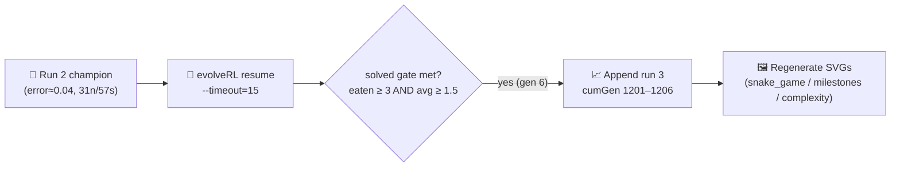

## Summary

Resumed evolution of the `snake_game` champion under the standard multi-run flow with a 15-minute
wall-clock budget (`snake_game/run.sh --timeout=15`). The persisted champion from run 2 was already
close to the multi-run target (`targetError = 0.01`) and the new run cleared the post-evolution
solved gate (`championEaten ≥ SOLVED_THRESHOLD` AND `meanEaten ≥ SOLVED_AVG_FLOOR`) within 6
generations — `Creature.evolveRL()` exited with `stopReason = "target"` after ~0.4s of wall-clock.
The +15 minute budget acted as the backstop, not the binding constraint — the issue's acceptance
criterion "PR raised even with no fitness gain" applies. Run 3 is now persisted in the multi-run
history and all `snake_game/` and `docs/` artefacts have been regenerated. Closes #386.

## Evidence

The refreshed multi-run artefacts are:

- `docs/data/snake_game/creature.json` — champion exported after run 3 (smaller topology than run
  2's: 26 neurons / 46 synapses, down from 31 / 57).
- `docs/data/snake_game/milestones.json` — appended run-3 milestones (4 new samples at cumulative
  generations 1201, 1202, 1205, 1206; final `bestScore = 0` → `error = 0`).
- `docs/screenshots/snake_game.svg` — animated champion replay (75 frames captured from the best
  evaluation seed).
- `docs/screenshots/snake_game/milestones.svg` — multi-run error chart refreshed with the new
  milestones.
- `docs/screenshots/snake_game/complexity.svg` — multi-run complexity chart refreshed with the new
  milestones.

Post-evolution scoring on the held-out evaluation seeds:
`Champion ate 8 food on the replay episode (avg=5.20 across 5 seeds,
score=465.64, generations=6, threshold=3, stop=target, wallclock=0.4s)`.

Per the issue's monitoring directive, the run log was inspected for abnormal NEAT-AI behaviour. The
library emitted the usual informational notices only (`MemoryMonitor` warning-level cache trim, "no
workers available for training" fallback to single-threaded inline rollouts, FFI permission notice
for the optional Rust discovery library). None of these are abnormal for a CLI invocation without
the parallel-pool adapter description, so no defect issue has been raised against `stSoftwareAU/*`.

## Test Plan

- `snake_game/run.sh --timeout=15` — resumed from prior champion, run 3 appended;
  `Multi-run charts updated under docs/screenshots/snake_game/ — 22
  cumulative milestones across 3 run(s)`.
- `./quality.sh < /dev/null` — the existing `snake_game/` test suites (`agent_test.ts`,
  `snake_test.ts`, `snake_game_test.ts`) continue to pass and the `Snake Game Example` runner
  section reports `SUCCESS`. One pre-existing failure was observed and is unrelated to this change:

  - `docs/archive_test.ts::No PR summary files remain in docs/ root` — fails because
    `docs/pr-summary-{380,381,382,383,384,385}.md` from sister refresh-PRs were left in `docs/` root
    by their merges (this PR's own `docs/pr-summary-386.md` adds to the same set per the worker's
    required artefact). Out of scope for an issue scoped to `snake_game/` only.

## Milestone

This PR is part of the **Refresh-2026-05** milestone and targets the `milestone/refresh-2026-05`
feature branch. Part of #369.
