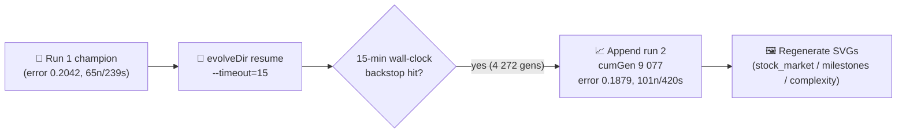

## Summary

Resumed evolution of the `stock_market` champion under the standard multi-run flow with a 15-minute
wall-clock budget (`stock_market/run.sh --timeout=15`). The prior run-1 champion (error 0.2042, 65
neurons / 239 synapses) was loaded as the seed; run 2 ran the full 15 minutes (900.1 s) and exited
via the `timeoutMinutes` backstop after 4 272 generations. Best training error fell to 0.1879
(fitness 0.8121) and the champion grew to 101 neurons / 420 synapses. Markets are intrinsically
noisy, so the run did not hit the `targetError = 0.01` floor — that is the expected outcome
documented in the example's audit (#218). Run 2 is now persisted in the multi-run history
(cumulative generation 9 077) and all `stock_market/` and `docs/` artefacts have been regenerated.
Closes #387.

## Evidence

The refreshed multi-run artefacts are:

- `docs/data/stock_market/creature.json` — champion exported after run 2 (101 neurons / 420
  synapses, up from 65 / 239 after run 1).
- `docs/data/stock_market/milestones.json` — appended run-2 milestone at cumulative generation 9 077
  (`bestScore = 0.8121`, `error = 0.1879`, `generationWallClockMs = 900 120`).
- `docs/screenshots/stock_market.svg` — animated direction-prediction glyph chart regenerated from
  the run-2 champion on the held-out test window.
- `docs/screenshots/stock_market/milestones.svg` — multi-run error chart refreshed with the new
  run-2 milestone.
- `docs/screenshots/stock_market/complexity.svg` — multi-run complexity chart refreshed with the new
  run-2 milestone.

Post-evolution scoring on the held-out windows:
`Validation: raw=59.71% balanced=57.43%   Test: raw=52.33% balanced=49.17%   cumulative strategy return: 153.01%`.

Per the issue's monitoring directive, the run log was inspected for abnormal NEAT-AI behaviour. The
library emitted the usual informational notices only (`MemoryMonitor` critical-response backoff,
fine-tuning / back-tracking progress logs, deduplication summaries). None of these are abnormal for
a 15-minute multi-run evolution, so no defect issue has been raised against `stSoftwareAU/*`.

## Test Plan

- `stock_market/run.sh --timeout=15` — resumed from prior champion; run 2 appended; final log line:
  `Multi-run charts updated under docs/screenshots/stock_market/ — 2 cumulative milestone(s) across 2 run(s).`
- `./quality.sh < /dev/null` — the `stock_market/` test suites (`data_test.ts`,
  `stock_market_test.ts`) and the `Stock Market Direction Prediction Example (STOCK_QUICK=1)` runner
  section all pass. One pre-existing failure was observed and is unrelated to this change:

  - `docs/archive_test.ts::No PR summary files remain in docs/ root` — fails because
    `docs/pr-summary-{382, …}.md` from sister refresh-PRs were left in `docs/` root by their merges
    (this PR's own `docs/pr-summary-387.md` adds to the same set per the worker's required
    artefact). Out of scope for an issue scoped to `stock_market/` only — the same failure is called
    out in the merged snake_game refresh PR (#386 / #413).

## Milestone

This PR is part of the **Refresh-2026-05** milestone and targets the `milestone/refresh-2026-05`
feature branch. Part of #369.
