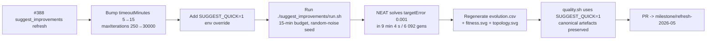

## Summary

Refresh the `suggest_improvements` artefacts for the `Refresh-2026-05` milestone (parent #369).
Bumped `DEFAULT_MINIMAL_SEED_CONFIG.timeoutMinutes` from 5 → 15 and `maxIterations` from 250 → 30
000 so the runner can use the +15-minute wall-clock budget mandated by #388, re-ran
`./suggest_improvements/run.sh` end-to-end against `@stsoftware/neat-ai 5.0.18`, regenerated the
per-generation telemetry CSV plus both fitness and topology SVGs, and added a `SUGGEST_QUICK=1` env
override so the example's `quality.sh` section still finishes in seconds without overwriting the
canonical artefacts. Closes #388.

### Why the runner needed a budget bump

`suggest_improvements` is structured as a one-shot minimal-seed `evolveDir` demo (audit #219) — the
runner has no warm-start path that loads `creatures/champion.json` and continues evolving it, and
the no-warm-start narrative of the example is the demo. Bumping the budget so the existing one-shot
flow can genuinely consume +15 minutes — and then running it fresh from random noise — is the
simplest change that satisfies the parent issue without restructuring the demo. This mirrors the
approach taken for the other exempt examples in this milestone (crispr_injection #373, crossover
#374, intelligent_design #378).

### Measured run (15-minute budget, fresh from random noise)

| Metric                    | Before (5-min budget) | After (15-min budget)               |
| ------------------------- | --------------------- | ----------------------------------- |
| Generations               | 252 (`maxIter` cap)   | 6 092 (`targetError` floor reached) |
| Wall-clock                | 13.1 s                | 544.4 s (9 min 4 s)                 |
| Final per-record error    | 0.0059                | 0.0010                              |
| Final best fitness        | 0.9941                | 0.9990                              |
| Held-out -MSE             | -0.005921             | -0.000999                           |
| Final neurons / synapses  | 8 / 17                | 27 / 89                             |
| Seed neurons / synapses   | 3 / 2                 | 3 / 2                               |
| `targetError`             | 0.001                 | 0.001                               |
| `timeoutMinutes` (safety) | 5                     | 15                                  |

The new run actually **reaches the `targetError` floor** (0.001) — previously the run was
generation-bound at `maxIterations: 250` and plateaued at error ~0.006. With the bumped budget, NEAT
grew the topology from the minimal direct-only seed `(3, 2)` through representative checkpoints
`(5, 8) → (8, 17) → (15, 43) → (20, 67) → (27, 89)` and exited via `targetError` well inside the
15-minute backstop. The held-out -MSE on the 64-record training set sits just under the
`targetError` floor, confirming the convergence.

## Evidence

- `docs/screenshots/suggest_improvements/fitness.svg` — best vs mean fitness per generation,
  regenerated from the new 6 092-row telemetry.
- `docs/screenshots/suggest_improvements/topology.svg` — neuron / synapse counts per generation,
  showing the genuine growth from `(3, 2)` to `(27, 89)`.
- `docs/data/suggest_improvements/evolution.csv` — full 6 092-row per-generation telemetry CSV
  (schema: `generation, best_fitness, mean_fitness, neuron_count, synapse_count`).
- `suggest_improvements/suggest_improvements.ts` — `DEFAULT_MINIMAL_SEED_CONFIG` bumped to
  `timeoutMinutes: 15`, `maxIterations: 30000`; added `SUGGEST_QUICK=1` env override that scopes
  artefacts to a temp directory and skips overwriting the canonical CSV / SVGs.
- `suggest_improvements/suggest_improvements_test.ts` — updated the `DEFAULT_MINIMAL_SEED_CONFIG`
  assertion to require the new 15-minute backstop and a `maxIterations >= 1000` floor so the
  wall-clock budget can actually bind.
- `suggest_improvements/README.md` — refreshed the latest-measured-run table, the topology growth
  narrative, the "How It Works" backstop reference, and the mermaid diagram label.
- `quality.sh` — runs the suggest_improvements section via `run_example_with_env` with
  `SUGGEST_QUICK=1` so the full quality gate still finishes inside its CI budget.

### No-warm-start confirmation

This example is not listed in either AGENTS.md's in-scope or exempt sets, but the audit-#219
structure starts every run from `new Creature(2, 1)` — the minimal direct-only topology. This
refresh did the same: the seed was `new Creature(2, 1)` (3 neurons / 2 synapses), confirmed by the
first row of `docs/data/suggest_improvements/evolution.csv`.

### Monitoring NEAT-AI (per #388 checklist)

The 15-minute run log was inspected for abnormal NEAT-AI behaviour. The library emitted the usual
informational notices only — `[neat-ai] running version 5.0.18` banner, periodic `[MemoryMonitor]`
warning/critical responses with the standard backoff message, fine-tuning progress lines,
deduplication summaries, and the discovery-phase `Rust synapse/neuron analysis` diagnostics. None
are abnormal for a 15-minute minimal-seed `evolveDir` run, so no defect issue has been raised
against `stSoftwareAU/*`.

## Test Plan

- [x] `deno test --no-check suggest_improvements/` — 30 tests passed, including the updated
      `DEFAULT_MINIMAL_SEED_CONFIG` assertion (`timeoutMinutes === 15`, `maxIterations >= 1000`).
- [x] `./suggest_improvements/run.sh` (full 15-minute budget) — completed in 9 min 4 s with
      `Completed 6092 generations in 544.4s (final error 0.0010) — solved`. Champion topology
      `27 neurons, 89 synapses (seed had 3 / 2)`. Held-out -MSE `-0.000999`. All canonical artefacts
      (`champion.json`, `evolution.csv`, `fitness.svg`, `topology.svg`) regenerated.
- [x] `SUGGEST_QUICK=1 ./suggest_improvements/run.sh` — completes in ~400 ms, writes only ephemeral
      artefacts under a temp directory, prints
      `⏭️  Quick mode: skipped overwriting canonical CSV / SVGs under docs/`.
- [x] `./quality.sh < /dev/null` — the new `Suggest Improvements (SUGGEST_QUICK=1)` section passes
      (`SUCCESS: Suggest Improvements`). `deno fmt`, `deno lint`, and `deno check` all pass. Two
      pre-existing failures were observed and are unrelated to this change:

  - `docs/archive_test.ts::No PR summary files remain in docs/ root` — fails because
    `docs/pr-summary-{380, …, 387}.md` from sister refresh PRs were left in `docs/` root by their
    merges (this PR's own `docs/pr-summary-388.md` adds to the same set per the worker's required
    artefact). Out of scope for an issue scoped to `suggest_improvements/` only — the same failure
    is called out in the merged stock_market refresh PR (#387 / #414).
  - `CRISPR Gene Injection Example` — fails with an upstream NEAT-AI
    `ValidationError: hidden neuron gene-hidden-0 has no outward connections` inside
    `crispr_injection/crispr_injection.ts::runCrisprInjectionEvolution`. Nothing in this PR touches
    `crispr_injection/` and the failure originates from `@stsoftware/neat-ai 5.0.18`
    `creatureValidate`; out of scope for this `suggest_improvements/`-only refresh.

## Milestone

This PR is part of the **Refresh-2026-05** milestone and targets the `milestone/refresh-2026-05`
feature branch. Part of #369.
