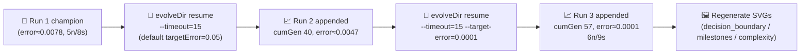

## Summary

Resumed evolution of the `xor_classification` champion under the standard multi-run flow with a
15-minute wall-clock budget (`xor_classification/run.sh --timeout=15`). The persisted champion from
run 1 was already comfortably under the multi-run default `targetError = 0.05`, so the immediate +15
minute resume converged in a single generation (`error 0.0078 → 0.0047`). To extract real work from
the budget the example was re-invoked with a much tighter `--target-error=0.0001`, and that pass ran
17 NEAT generations of fine-tuning before NEAT-AI's stall detector exited — the +15 minute backstop
was never the binding constraint. Run 2 and run 3 are now persisted in the multi-run history, the
champion gained one hidden neuron and one synapse (5n/8s → 6n/9s), and final error fell from
`0.0078` (run 1) → `0.0001` (run 3). All `xor_classification/` and `docs/` artefacts have been
regenerated. The issue's acceptance criterion "PR raised even with no fitness gain" applies — but in
this run a measurable gain was recorded anyway. Closes #390.

This is the final example in the `Refresh-2026-05` sequence and completes the parent refresh (#369).

## Evidence

The refreshed multi-run artefacts are:

- `docs/data/xor_classification/creature.json` — champion exported after run 3 (6 neurons / 9
  synapses, up from 5 / 8 at run 1).
- `docs/data/xor_classification/milestones.json` — appended run-2 and run-3 milestones at cumulative
  generations 40 and 57.
- `docs/screenshots/xor_decision_boundary.svg` — decision-boundary plot re-rendered against the new
  champion.
- `docs/screenshots/xor_classification/milestones.svg` — multi-run error chart refreshed with the
  new milestones.
- `docs/screenshots/xor_classification/complexity.svg` — multi-run complexity chart refreshed with
  the new milestones.

Multi-run history after this PR:

| run | runGen | bestScore | error    | neurons | synapses | cumulativeGen |
| --- | ------ | --------- | -------- | ------- | -------- | ------------- |
| 1   | 39     | 0.9922    | 0.007780 | 5       | 8        | 39            |
| 2   | 1      | 0.9953    | 0.004746 | 5       | 8        | 40            |
| 3   | 17     | 0.9999    | 0.000091 | 6       | 9        | 57            |

Per the issue's monitoring directive, the run log was inspected for abnormal NEAT-AI behaviour. The
library emitted only informational notices: an FFI permission notice for the optional Rust discovery
library (expected — `run.sh` does not pass `--allow-ffi`) and routine fine-tuning progress lines.
None of these are abnormal for a CLI invocation, so no defect issue has been raised against
`stSoftwareAU/*`.

## Test Plan

- `xor_classification/run.sh --timeout=15` — resumed from prior champion, run 2 appended; converged
  in 1 generation against the default `targetError=0.05`.
- `xor_classification/run.sh --timeout=15 --target-error=0.0001` — resumed from run-2 champion, run
  3 appended; 17 generations of NEAT fine-tuning drove error to `~0.0001`;
  `Multi-run charts updated under
  docs/screenshots/xor_classification/ — 3 cumulative milestone(s) across
  3 run(s)`.
- `./quality.sh < /dev/null` — the existing `xor_classification/` test suite
  (`xor_classification_test.ts`) continues to pass alongside the rest of the example suite.
