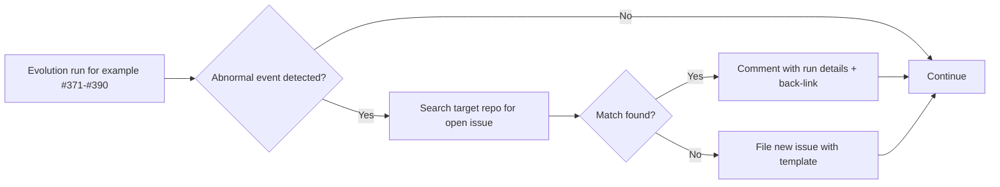

## Summary

Added `docs/monitoring-neat-ai.md` — the single in-repo reference document that defines the
procedure the worker follows when monitoring NEAT-AI and its `stSoftwareAU/*` supporting libraries
during re-evolve runs (#371–#390). The doc covers in-scope repos, abnormal-event criteria, the
de-duplication procedure, the defect-issue template, and the idempotent checklist snippet (wrapped
in `<!-- MONITOR-NEAT-AI-START -->` / `<!-- MONITOR-NEAT-AI-END -->` markers) that the follow-up
sub-issue will inject into each re-evolve issue body.

Closes #393.

## Evidence

This is a documentation-only change — no UI, no runtime behaviour, no performance metric.
Verification was:

- `./quality.sh < /dev/null` passed cleanly (markdown lint included).
- Doc renders correctly on GitHub: Mermaid diagram in a fenced `` ```mermaid `` block, headings
  well-formed, HTML-comment markers preserved verbatim so a future injector can locate them.



## Test Plan

- [x] `./quality.sh < /dev/null` passes (lint + all examples).
- [x] `docs/monitoring-neat-ai.md` contains all five required sections.
- [x] In-scope repos list includes `stSoftwareAU/NEAT-AI`, `stSoftwareAU/NEAT-AI-core`, and
      `stSoftwareAU/TagsTS`, with third-party deps explicitly out of scope.
- [x] Doc explains how to refresh the in-scope list from NEAT-AI's `deno.json` (`neatCore` field
      plus `@stsoftware/*` JSR imports).
- [x] Checklist snippet sits between `<!-- MONITOR-NEAT-AI-START -->` and
      `<!-- MONITOR-NEAT-AI-END -->` markers, as a single `- [ ]` item referencing this doc by
      relative path.
- [x] PR scoped to `docs/monitoring-neat-ai.md` plus this PR summary file; no other source files
      changed.
