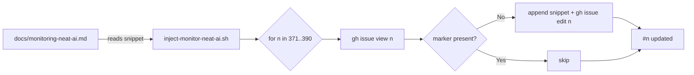

# Inject Monitor NEAT-AI checklist into re-evolve issues #371-#390

## Summary

Adds an idempotent bash script `scripts/inject-monitor-neat-ai.sh` that injects the "Monitor
NEAT-AI" checklist snippet (defined in `docs/monitoring-neat-ai.md`, delivered by #393) into the
body of each re-evolve issue #371-#390. Ran the script to perform the actual injection across all 20
issues, then re-ran it to prove idempotency.

The script reads the snippet block (between `<!-- MONITOR-NEAT-AI-START -->` and
`<!-- MONITOR-NEAT-AI-END -->`) directly out of `docs/monitoring-neat-ai.md` rather than duplicating
it, so the doc remains the single source of truth.

Closes #394.

## Issues edited (20 total)

#371, #372, #373, #374, #375, #376, #377, #378, #379, #380, #381, #382, #383, #384, #385, #386,
#387, #388, #389, #390.

Parent #391 and dep-bump #370 were **not** touched (verified — both contain zero
`MONITOR-NEAT-AI-START` markers).

## Evidence

### First run — injected all 20 issues

```text
$ ./scripts/inject-monitor-neat-ai.sh
#371: injected
#372: injected
... (through #390)
#390: injected
```

### Second run — idempotent, skipped all 20

```text
$ ./scripts/inject-monitor-neat-ai.sh
#371: skipped (already present)
... (through #390)
#390: skipped (already present)
```

### Marker-count verification (post-injection)

Each of #371-#390 now contains **exactly one** `<!-- MONITOR-NEAT-AI-START -->` marker in its body.
Verified by:

```bash
for n in $(seq 371 390); do
  gh issue view "$n" --repo stSoftwareAU/NEAT-AI-Examples --json body --jq '.body' \
    | grep -cF '<!-- MONITOR-NEAT-AI-START -->'
done
```

All 20 issues returned `1`.

### Untouched-issues verification

```text
#370: 0 START marker(s) (should be 0)
#391: 0 START marker(s) (should be 0)
```

### Flow diagram



## Test Plan

Added `scripts/inject_monitor_neat_ai_test.ts` — Deno unit tests that exercise the script via a mock
`gh` binary so no real GitHub calls are made. The tests cover:

- `first run injects snippet into Acceptance Criteria` — happy path; verifies the snippet is
  inserted before the next H2 heading and existing criteria are preserved.
- `second run is idempotent (skipped)` — re-running on a body that already contains the START marker
  emits `skipped (already present)` and **does not** call `gh issue edit`.
- `appends new Acceptance Criteria section when none exists` — graceful fallback when the original
  issue body has no `## Acceptance Criteria` section.
- `gh edit failure produces non-zero exit` — simulates an `gh issue edit` failure; the script
  reports `error:` and exits non-zero (satisfies the acceptance criterion).
- `exactly one START marker after injection` — guards against a double-injection regression.

All five tests pass:

```text
running 5 tests from ./scripts/inject_monitor_neat_ai_test.ts
inject-monitor-neat-ai: first run injects snippet into Acceptance Criteria ... ok
inject-monitor-neat-ai: second run is idempotent (skipped) ... ok
inject-monitor-neat-ai: appends new Acceptance Criteria section when none exists ... ok
inject-monitor-neat-ai: gh edit failure produces non-zero exit ... ok
inject-monitor-neat-ai: exactly one START marker after injection ... ok
ok | 5 passed | 0 failed
```

## Files

- `scripts/inject-monitor-neat-ai.sh` — the idempotent bulk-edit script (executable).
- `scripts/inject_monitor_neat_ai_test.ts` — Deno unit tests with a mock `gh`.
- `quality.sh` — added `bash` to `--allow-run` so the new test can spawn the script under test
  (single-character change: `--allow-run=df` → `--allow-run=df,bash`).
- `docs/pr-summary-394.md` — this PR summary.
