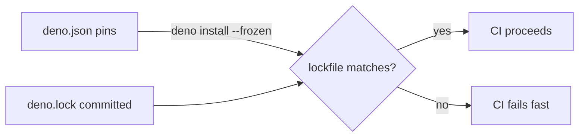

# Commit deno.lock and enforce `--frozen` in CI

## Summary

`deno.lock` was gitignored, so CI re-resolved dependencies on every run and was exposed to whatever
JSR currently served for the pinned specifier — including unconstrained transitive bumps that the
Dependency Review action cannot see. This PR commits the canonical lockfile and switches CI to
`--frozen` so any drift between `deno.json` and `deno.lock` now fails the build instead of silently
rewriting the lockfile. Closes #418.

Changes:

- `.gitignore` — removed the `deno.lock` entry so the file is tracked.
- `deno.lock` — generated via `deno install` (resolves `@stsoftware/neat-ai@5.0.18` and every
  transitive `@std/*` dep to a single concrete version).
- `.github/workflows/quality.yml` — added an explicit `deno install --frozen` step that fails fast
  on drift, and passed `--frozen` to `deno test` so test runs reject lockfile drift too.
- `quality.sh` — added `--frozen` to the local `deno test` command for parity with CI.
- `bump-deps.sh` — updated the header comment so the bump workflow reminds maintainers to commit
  `deno.lock` alongside `deno.json`.
- `common/lockfile_test.ts` — new behavioural tests asserting the lockfile is tracked, not
  gitignored, and resolves every `deno.json` pin to the matching version (regression guard for
  #418).

## Evidence

This is a CI/build-hygiene change with no UI to screenshot. Evidence:

- `deno install --frozen` exits 0 against the committed lockfile, proving the import map and
  lockfile are consistent.
- `deno test --frozen common/` passes 117 tests, proving the test runner accepts the lockfile.
- The new `common/lockfile_test.ts` adds three regression tests that fail if the lockfile is ever
  removed, re-gitignored, or allowed to drift from `deno.json`.

## Test Plan

- [x] `gtimeout 60 deno test --frozen --no-check --allow-read
      common/lockfile_test.ts` — 3
      passed, 0 failed.
- [x] `gtimeout 300 deno test --frozen --no-check --allow-read
      --allow-write --allow-env --allow-net --allow-ffi
      --allow-run=df,bash common/`
      — 117 passed, 0 failed.
- [x] `deno install --frozen` exits 0 (no drift).
- [x] `deno lint` and `deno fmt` clean.
