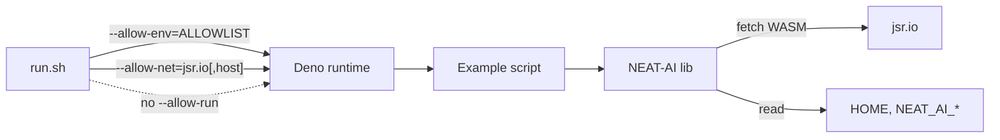

# Tighten over-broad Deno permission flags in `*/run.sh` wrappers

## Summary

Every per-example `run.sh` previously granted bare `--allow-env` and bare `--allow-net`; four
(`adaptive_mutation`, `crossover`, `neuron_pruning`, `synthetic_synapse`) also granted bare
`--allow-run`. Bare flags grant unrestricted access to every host environment variable (including
secrets such as `GITHUB_TOKEN` or any `*_API_KEY`), every network destination, and any binary on the
host. Because this is a public examples repo, the over-broad flags propagate every time a reader
copies a runner into their own project.

This PR replaces the bare flags with scoped allowlists:

- **`--allow-env`** — narrowed to the eight env vars `@stsoftware/neat-ai` actually reads (`HOME`,
  `USERPROFILE`, `DENO_TEST`, `NEAT_AI_DISCOVERY_LIB_PATH`, `NEAT_AI_DISCOVERY_VERBOSE`,
  `NEAT_AI_TRACE_PREDICTION`, `NEAT_AI_WORKER_INIT_TIMEOUT_MS`, `NEAT_DISCOVERY_AWAIT_CLEANUP`) plus
  the per-example `*_QUICK` flag and (where used) `NEAT_MULTI_RUN_BASE_DIR`.
- **`--allow-net`** — scoped to `jsr.io` for every runner (NEAT-AI fetches its WASM activation
  payload from `jsr.io` at runtime via `WasmActivationPayload.ts`). The two data-fetching examples
  also whitelist their dataset host: `storage.googleapis.com` for MNIST and
  `raw.githubusercontent.com` for the S&P 500 monthly-close set.
- **`--allow-run`** — removed entirely from all four runners that previously granted it. None of the
  example scripts spawn subprocesses via `Deno.run`/`Deno.Command`. The `quality.sh` wrapper still
  injects `--allow-run=df` for the NEAT-AI discovery disk-space check during the full quality run,
  so the broader run still works.

Closes #419.

## Evidence

This is a CLI/security policy change with no UI surface. Verification:

- `deno test --no-check --allow-read common/run_sh_permissions_test.ts` passes the seven new
  regression tests added by this PR.
- The full unit-test suite (`deno test --frozen ...`) reports `770 passed | 0 failed (1m35s)` with
  the scoped flags in place.
- `XOR_QUICK=1 ./xor_classification/run.sh` and `CART_POLE_QUICK=1 ./cart_pole/run.sh` complete
  end-to-end against the scoped permission set (NEAT-AI's runtime `fetch(jsr.io/...)` for the WASM
  payload is now explicitly allowed).

## Test Plan

Added `common/run_sh_permissions_test.ts` with seven regression tests:

- `no run.sh uses a bare --allow-run` — fails if any runner reintroduces unrestricted spawn.
- `no run.sh uses a bare --allow-env` — fails if any runner reintroduces unrestricted env read.
- `no run.sh uses a bare --allow-net` — fails if any runner reintroduces unrestricted egress.
- `mnist runner scopes --allow-net to the dataset host` — guards the MNIST runner against losing
  `storage.googleapis.com` from its allowlist.
- `stock-market runner scopes --allow-net to the dataset host` — guards the S&P 500 runner against
  losing `raw.githubusercontent.com`.
- `every run.sh allows jsr.io for the NEAT-AI WASM fetch` — guards every runner against losing
  `jsr.io` from its `--allow-net` allowlist (the WASM payload fetch would otherwise crash at
  runtime).
- `--allow-env allowlists exclude obvious secret-bearing names` — fails if a future change adds a
  secret env var (e.g. `GITHUB_TOKEN`) to any runner's allowlist.

The tests strip shell comments before scanning so the runners can document their permission choices
inline without false positives.
