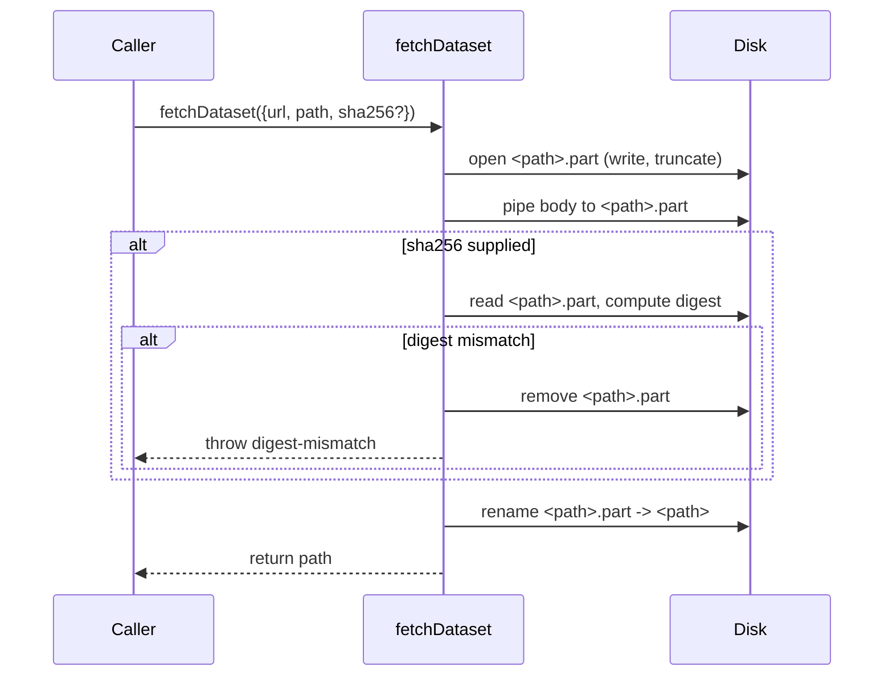

## Summary

`common/data_cache.ts::fetchDataset` now streams the response body to a sibling `<path>.part`
scratch file and only renames it onto the final destination after the SHA-256 digest verifies (or
after EOF when no digest is requested). Previously the body streamed directly to the final path, so
a process kill or full disk between `open` and the post-write digest check could leave a truncated
file at the final path that a later run would silently treat as a cache hit. This mirrors the
atomic-write pattern already used by `common/multi_run_state.ts::safeWriteJson`. Closes #421.

## Evidence

This is a backend/library change with no web interface. Evidence is the new unit tests in
`common/data_cache_test.ts` and the existing suite continuing to pass.



Targeted test run:

```
running 8 tests from ./common/data_cache_test.ts
fetchDataset downloads a file and writes the expected bytes ... ok
fetchDataset uses the on-disk cache on the second call ... ok
fetchDataset rejects on digest mismatch and removes the partial file ... ok
fetchDataset falls back to a mirror when the first URL 404s ... ok
fetchDataset writes atomically — final path never sees partial bytes ... ok
fetchDataset does not leave a .part file behind on success ... ok
fetchDataset cleans up .part on digest mismatch ... ok
fetchDataset honours a matching digest as a cache hit ... ok

ok | 8 passed | 0 failed
```

Whole `common/` suite: 117 passed, 0 failed.

## Test Plan

- Added `fetchDataset writes atomically — final path never sees partial bytes` — slow-stream test
  that proves the final path is empty mid-download and the bytes are accumulating in `<path>.part`.
  Fails against the unfixed code (final path exists with truncated bytes during pipe).
- Added `fetchDataset does not leave a .part file behind on success` — asserts the scratch file is
  cleaned up by the rename.
- Added `fetchDataset cleans up .part on digest mismatch` — asserts no scratch file remains when a
  bad digest forces a reject.
- All pre-existing `data_cache_test.ts` cases still pass unchanged.
