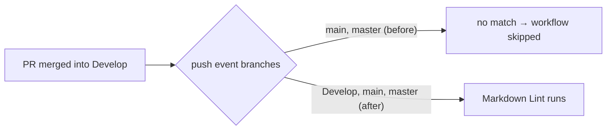

# Fix Markdown Lint workflow trigger on push to Develop (Issue #435)

## Summary

`Markdown Lint` was not running automatically after pull requests were merged into the default
branch. The workflow's `push` trigger only listed `[main, master]`, but this repository's default
branch is `Develop` — so push events from merges into `Develop` never matched and the workflow never
fired.

The sibling repository `stSoftwareAU/NEAT-AI` already lists `Develop` in its `markdown-lint.yml`
push trigger, which is why the action triggers as expected there. This change brings
NEAT-AI-Examples into line.

Closes #435.

## Evidence

This is a CI/configuration change with no UI to screenshot. Correctness is verified by a new
workflow-trigger test parsing the YAML and asserting the trigger set.



Before:

```yaml
on:
  pull_request:
    branches: ["*"]
  push:
    branches: [main, master]
```

After:

```yaml
on:
  pull_request:
    branches: ["*"]
  push:
    branches: [Develop, main, master]
```

## Test Plan

- Added `.github/markdown_lint_workflow_test.ts` with two cases:
  - `triggers on push to Develop` — fails against the old workflow, passes after the fix.
  - `triggers on pull_request to any branch` — guards against an accidental regression of the
    existing PR trigger.
- Ran `deno test --allow-read .github/` locally — 9 passed, 0 failed.
- Other PR-only workflows (`gitleaks`, `semgrep`, `shellcheck`, `dependency-review`,
  `deno-outdated`) already trigger on every PR by design; no change required.
