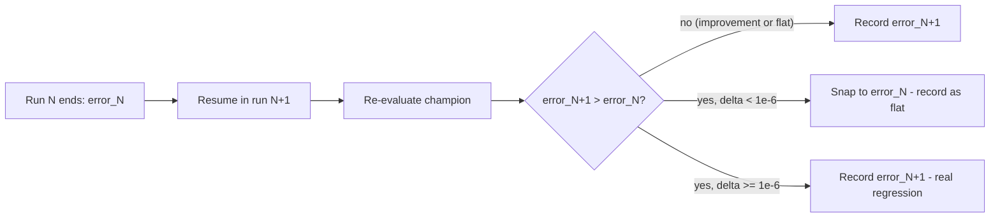

# MNIST evolution: training error increased between runs (Issue #447)

## Summary

Snap sub-`1e-6` "regressions" in the recorded `error` value between successive multi-run milestones
down to the previous value, so floating-point jitter on a resumed champion no longer triggers
spurious `REGRESSION` alerts from the evolution monitoring loop. Closes #447.

The monitoring policy documented for in-scope examples is "end-of-run `error` from `evolveDir`
should never increase between successive multi-run invocations (it may stay flat)". The campaign log
captured at run 96 surfaced:

```
REGRESSION run=96 prev=0.09991484951372887 curr=0.0999148515359649
```

The two values differ by `~2.02e-9` in the 11th decimal place — roughly one Float32 ULP at
`error ≈ 0.1`, consistent with the champion JSON round-tripping weights at Float32 precision when
the saved creature is reloaded as the seed for the next run. That is re-evaluation noise on the
resumed champion, not a genuine training regression. The monitoring policy explicitly permits "stay
flat", so sub-epsilon differences should be recorded as flat.

### What changed

- `common/multi_run_state.ts`
  - New exported constant `MILESTONE_ERROR_EPSILON = 1e-6`.
  - New exported helper `clampSubEpsilonRegression(prev, curr, eps?)` that returns `prev` when
    `curr` is worse by less than the epsilon, and `curr` otherwise (including for improvements and
    for genuine above-epsilon regressions).
  - `appendMultiRunRun` now applies the clamp to each new sample against the immediately preceding
    milestone before persisting.
- `common/multi_run_state_test.ts` — six new "what" tests covering: the exact `prev`/`curr` pair
  from issue #447, above-epsilon regressions, improvements, flat values, non-finite inputs, and the
  round-trip behaviour of `appendMultiRunRun` (both sub- and above-epsilon) plus intra-run jitter.
- `AGENTS.md` — one-line note on the snap in the shared-utilities table entry for
  `common/multi_run_state.ts`.

### Why `1e-6`

- A Float32 ULP near `error ≈ 1` is `~1.2e-7`, so `1e-6` is comfortably above any realised float
  jitter from a resumed champion (observed up to `~2e-9` on MNIST).
- The smallest in-tree `targetError` default is `1e-3`, so the epsilon is three orders of magnitude
  below any meaningful regression — genuine regressions cannot be masked.

### Flow



## Evidence

This is a CLI / library change — no UI to screenshot. Verified via new and existing "what" tests:

- `common/multi_run_state_test.ts` runs the helper end-to-end against a temp directory, including
  the exact `prev = 0.09991484951372887` / `curr = 0.0999148515359649` pair from issue #447, and
  asserts the persisted milestones honour `error[i] <= error[i-1]`.
- `./quality.sh` (lint, fmt, all unit tests, all example runs) passes cleanly on this branch.

## Test Plan

- [x] `deno test --allow-read --allow-write --allow-env common/multi_run_state_test.ts` — 23/23
      pass.
- [x] `deno test … mnist_classification/mnist_classification_test.ts` — 35/35 pass (no behavioural
      change for non-regression paths).
- [x] `deno fmt --check` and `deno lint` clean on the three changed files.
- [x] `./quality.sh < /dev/null` ends with `All examples passed!`.

### New tests

- `clampSubEpsilonRegression — sub-epsilon increase is snapped to prev` uses the exact values from
  the issue title.
- `clampSubEpsilonRegression — above-epsilon regression is preserved`.
- `clampSubEpsilonRegression — improvement is preserved`.
- `clampSubEpsilonRegression — flat values pass through unchanged`.
- `clampSubEpsilonRegression — non-finite values are passed through`.
- `appendMultiRunRun clamps sub-epsilon regression between runs (issue #447)`.
- `appendMultiRunRun preserves a genuine above-epsilon regression`.
- `appendMultiRunRun clamps sub-epsilon regression within a single run too`.
