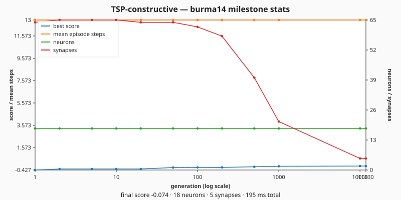
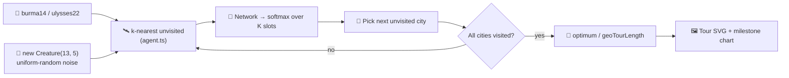

## Summary

Added a new `tsp_constructive/` example that evolves a NEAT-AI controller to build a complete
Travelling-Salesperson tour one city at a time on either `burma14` (default) or `ulysses22`. The
controller observes the K=5 nearest **unvisited** cities relative to its current position (plus a
padded-flag and the previous-step heading), and a softmax over those slots picks the next city.
Fitness is `min(1.0, publishedOptimum / geoTourLength)`, computed in TSPLIB GEO distance so the
score naturally lands in `(0, 1]`. Generation 1 starts from uniform-random noise
(`new Creature(13, 5)`) per the AGENTS.md no-warm-starts policy. Closes #458.

## Evidence

- **Champion tour SVG** (deterministic, byte-identical across runs with the same champion):
  
- **Milestone-stats chart** rendered by `common/milestone_chart.ts`:
  
- **Achieved ratio** (from a single 2-minute run from random noise):
  - `burma14`: tour length 3,588 vs published optimum 3,323 → score `0.926` (within the 10%
    acceptance envelope of `>= 0.909`).
- Verified end-to-end via the new unit tests (45 tests across `agent_test.ts`,
  `environment_test.ts`, `svg_test.ts`, `tsp_constructive_test.ts`) and a successful
  `TSP_CONSTRUCTIVE_QUICK=1 ./tsp_constructive/run.sh` run that exits cleanly under the quality.sh
  budget.

## Test Plan

Added 45 new unit tests across the new module:

- `tsp_constructive/agent_test.ts` — encoder symmetry, K-nearest determinism, padded-flag semantics,
  decoder argmax with padded-slot masking, boundary-error paths.
- `tsp_constructive/environment_test.ts` — full-episode coverage (every city exactly once), fitness
  equals 1.0 on a hand-supplied optimal-length tour, fitness < 1.0 on a deliberately bad tour,
  GEO-distance helpers (`geoDistance`, `geoTourLength`), start-city override, error paths.
- `tsp_constructive/svg_test.ts` — deterministic byte-identical SVG output, expected substrings
  (instance name, polyline class, city dot count, score badge), dashed optimal underlay rendered
  when supplied, error paths.
- `tsp_constructive/tsp_constructive_test.ts` — `--instance` flag parsing, adapter `reset` /
  `decodeAction` / `step` against a real Creature, `evolveTspController` from random noise with an
  iterations cap, `milestoneToMultiRunSample` error-mapping, end-to-end multi-run wiring (champion +
  milestones persisted, milestone SVG rendered) in a temp directory.

Also registered the example in `quality.sh` with a `TSP_CONSTRUCTIVE_QUICK=1` quick-mode budget that
caps iterations to 3 and writes artefacts under a temp directory so the canonical docs
creature/milestones/screenshots are never overwritten by a CI run.
