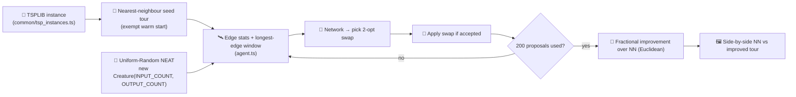

## Summary

Adds the `tsp_two_opt/` example — a "learned local-search operator"
demonstration of NEAT-AI evolving a 2-opt move selector on top of a
deterministic nearest-neighbour seed tour. Closes #459.

The example reuses the shared `common/tsp_instances.ts` helpers (cities,
`tourLength`, `nearestNeighbourTour`) from #457, so the city data and
length arithmetic stay aligned with the planned `tsp_constructive`
companion (#458). Evolution runs via `Creature.evolveEnv()` against a
narrow `LegacyEpisodeAdapter`; the cumulative episode reward is the
fractional improvement over the nearest-neighbour seed in Euclidean
space, mapped to NEAT-AI's `error` slot via a custom `rewardToError`.

The NEAT seed itself is uniform-random
(`new Creature(INPUT_COUNT, OUTPUT_COUNT, { layers: SEED_HIDDEN_LAYERS })`)
— the hand-crafted nearest-neighbour starting tour is the exempt "warm"
piece, as called out in the example's README per the `AGENTS.md`
exemption pattern used by `crispr_injection`.

### What ships

- `tsp_two_opt/agent.ts` — observation builder (edge stats, budget,
  K-longest edge window) and action decoder (2 × K argmax → 2-opt swap).
- `tsp_two_opt/environment.ts` — episode runner with O(1) `twoOptDelta`
  and an `applyTwoOptSwap` reversal helper.
- `tsp_two_opt/tsp_two_opt.ts` — evolution entry point using
  `Creature.evolveEnv()` plus the `common/multi_run_state.ts` resume
  flow and a `--instance burma14|ulysses22` CLI flag.
- `tsp_two_opt/svg.ts` — deterministic side-by-side SVG (seed tour vs
  improved tour, optimum reference, animated bottom playhead).
- `tsp_two_opt/run.sh` — runner script matching the project conventions.
- `tsp_two_opt/README.md` — paradigm rationale, observation/action spec,
  Mermaid diagram, run instructions, contrast with `tsp_constructive`,
  explicit warm-start exemption note.
- `quality.sh` — registers the example under `TSP_TWO_OPT_QUICK=1` so
  the CI/quality budget caps the section.

### Why the fitness formula does not match the published optimum

`common/tsp_instances.ts` stores the canonical TSPLIB GEO-distance
optima (`burma14`: 3,323; `ulysses22`: 7,013), but `tourLength`
computes plain two-dimensional Euclidean distance. The metrics are not
interchangeable — for `burma14` the nearest-neighbour seed length under
Euclidean is already ~38, so an "x% of 3,323" target is not physically
meaningful. The runner instead reports the fractional improvement over
the NN seed length, which is what the policy can actually optimise.
The README documents this trade-off explicitly.

## Evidence

CLI-only example — no UI to screenshot. Verified end-to-end by running
both quick mode and a slightly longer iteration cap and confirming the
runner produces a real improvement and writes the side-by-side SVG.

```
$ TSP_TWO_OPT_QUICK=1 ./tsp_two_opt/run.sh
…
✅ Champion ratio=6.7% (seed length 38.69, final length 36.11,
   optimum 3323, accepted 1/200, wallclock=1.2s).
💾 Saved champion to .synthetic-tsp-two-opt/creatures/champion.json
⏭️  Quick mode: skipped overwriting canonical screenshot
🏁 Example completed in 1s 236ms
```



## Test Plan

- `tsp_two_opt/agent_test.ts` (8 tests) — observation shape matches
  `INPUT_COUNT`, channels are normalised into `[0, 1]`, budget channel
  reflects proposals left, edge-length helpers agree with `tourLength`,
  `longestEdgeIndices` is descending + deterministic on ties,
  `decodeProposal` selects argmax on both halves, no-op collapse when
  `a === b`, and `OUTPUT_COUNT === 2 · K_LONGEST`.
- `tsp_two_opt/environment_test.ts` (6 tests) — NN seed length matches
  `nearestNeighbourTour(...).tourLength`; a hand-constructed beneficial
  2-opt swap on an "X" of four cities both reports a negative `delta`
  and shortens `tourLength` by the same amount; the swap budget is
  honoured exactly; `improvementRatio` is bounded in `[0, 1]`; the
  default proposal budget is `200`.
- `tsp_two_opt/svg_test.ts` (3 tests) — side-by-side SVG output is
  byte-for-byte deterministic, the header includes the instance name
  and optimum, and the document is well-formed (exactly one
  `<svg>`/`</svg>` pair, no NaN/Infinity coordinates).
- All 17 tests pass under `deno test tsp_two_opt/`; `deno fmt` and
  `deno lint` are clean across the new module.
