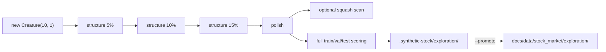

## Summary

Wires the GRQ-style **exploration campaign** pipeline (structure phases → polish phase → optional
intelligent-design pass) onto `stock_market` as the first in-scope example to adopt the pattern from
issue #476. The new runner subsamples training records during structure phases (`trainingSampleRate`
5 → 10 → 15% with a small positive `costOfGrowth`) so NEAT-AI grows topology cheaply, then switches
to a polish phase (`trainingSampleRate = 1`, `costOfGrowth = 0`) for honest weight/bias tuning.
After every phase the champion is scored against the **full** train, validation, and test windows
via the existing `directionalAccuracy` and `balancedDirectionalAccuracy` helpers, so the recorded
series stays apples-to-apples across phases. All artefacts land under
`.synthetic-stock/exploration/` (hidden, gitignored); `--promote` copies the champion + summary to
`docs/data/stock_market/exploration/`.

Also fixes a pre-existing `deno.lock` drift (the lock pinned `@stsoftware/neat-ai@5.0.30` while
`deno.json` already pinned `5.0.32`, which would have broken `quality.sh --frozen` once any test
imported the bump).

Closes #476.

## Evidence

CLI / orchestration change with no UI surface — verified via the unit tests below. Mermaid diagram
added to `stock_market/README.md` (new "GRQ-Style Exploration Campaign" section) showing the phase
pipeline and the hidden-dir → promote-dir flow:

Full `deno test` run: **916 passed | 0 failed (1m5s)**. The eight new exploration-campaign tests
verify (a) `DEFAULT_EXPLORATION_PHASES` structure-then-polish shape, (b) one phase record per
configured phase, (c) full-split scoring after every phase, (d) `champion.json` + `summary.json`
written into the working dir, (e) no implicit promotion, (f) `promoteExplorationArtefacts` copies
champion + summary to the promote dir, and (g, h) range checks on `phases` / `trainingSampleRate`.

## Test Plan

New tests in `stock_market/exploration_campaign_test.ts`:

- `DEFAULT_EXPLORATION_PHASES has structure phases before a polish phase`
- `runExplorationCampaign returns one phase record per configured phase`
- `runExplorationCampaign scores the champion on full train / val / test after every phase`
- `runExplorationCampaign writes champion + summary into the working dir`
- `runExplorationCampaign does not promote unless an explicit promote dir is provided`
- `promoteExplorationArtefacts copies champion + summary from working dir to promote dir`
- `runExplorationCampaign throws when phases is empty`
- `runExplorationCampaign throws when trainingSampleRate is out of range`

Manual verification:

- `deno lint` — clean across 136 files.
- `deno fmt --check` — clean across 392 files.
- `deno check **/*.ts` — clean.
- `deno test --frozen ...` — 916 / 916 pass.
