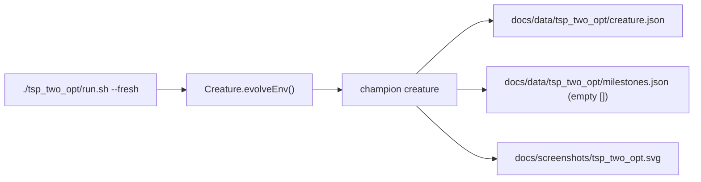

## Summary

Ran `./tsp_two_opt/run.sh --fresh` against the default `burma14` instance and committed the three
output artefacts the example's README already promises:

- `docs/screenshots/tsp_two_opt.svg` — side-by-side seed vs improved tour SVG.
- `docs/data/tsp_two_opt/creature.json` — champion `CreatureExport` (47 neurons, 655 synapses).
- `docs/data/tsp_two_opt/milestones.json` — empty array (`[]`), the truthful representation of what
  the runner produces: `Creature.evolveEnv()` emits no milestone payloads (documented in-source in
  `tsp_two_opt.ts`).

No code changes — the existing runner is sufficient. Closes #478.

## Achieved improvement

```
Champion ratio=11.6%
seed length 38.69, final length 34.19
accepted 4/200 swaps, wallclock=300.0s
```

The full single-instance evolution finished in ~5 minutes, matching the README's wall-clock
estimate.

## Evidence

- **SVG validity**: file starts with `<svg`, embeds the labels `Nearest-neighbour seed` and
  `Post-evolution improved`, and parses as a 3,593-byte standalone SVG.
- **creature.json**: parses as a valid `CreatureExport` document (47 neurons, 655 synapses).
- **milestones.json**: parses as a JSON array of length 0, exactly as the in-source comment in
  `tsp_two_opt.ts` predicts:

  > evolveEnv does not emit milestone payloads; we record nothing here…

- **Quick-mode preservation**: `TSP_TWO_OPT_QUICK=1 ./tsp_two_opt/run.sh` routes all artefacts
  (champion, milestones, SVG) under a per-invocation temp dir — the committed
  `docs/screenshots/tsp_two_opt.svg` and `docs/data/tsp_two_opt/*` are not overwritten when
  `quality.sh` runs the example via `run_example_with_env "... TSP_TWO_OPT_QUICK=1"`.
- **`deno fmt`-stable**: both JSON files pass `deno fmt --check` cleanly.



## Test Plan

- [x] `./tsp_two_opt/run.sh --fresh` completed successfully on burma14 (Champion ratio=11.6%,
      wallclock=5m).
- [x] Three artefact files exist and parse correctly (SVG, CreatureExport JSON, JSON array).
- [x] `TSP_TWO_OPT_QUICK=1 ./tsp_two_opt/run.sh` writes artefacts to a temp dir and does NOT
      overwrite the canonical committed files.
- [x] `deno fmt --check docs/data/tsp_two_opt/` passes.
- [x] No code changes outside the three artefact files.
