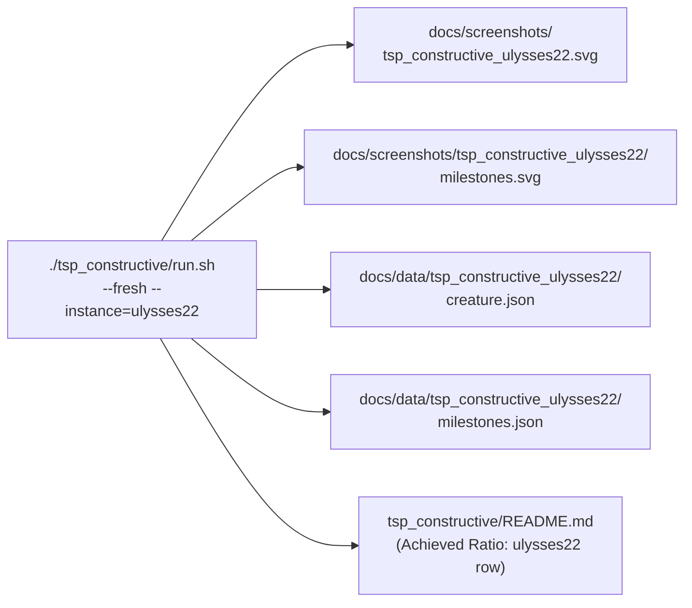

## Summary

Generated and committed the missing `tsp_constructive_ulysses22` artefact bundle so the
`tsp_constructive/README.md` references resolve, mirroring the existing `tsp_constructive_burma14`
layout. Ran a fresh 5-minute evolution against the `ulysses22` TSPLIB instance via
`./tsp_constructive/run.sh --fresh --instance=ulysses22`, captured the deterministic champion-tour
SVG, milestones SVG, champion JSON, and merged milestone history, and filled in the previously
`TBD` `ulysses22` row in the "Achieved Ratio" table with the run's actual numbers. Closes #479.

### Run results

- Champion tour length: **7,416** (GEO km)
- Score (`optimum / length` = `7013 / 7416`): **0.946**
- Stop condition: `timeout` after 21,245 generations / 5 min wall-clock
- Milestones written: **12** (cadence `1, 2, 5, 10, 20, 50, 100, 200, 500, 1000, …`)

## Evidence

This is a pure artefact-and-doc commit — no code changed.

### Artefacts committed

| Path | Purpose |
| --- | --- |
| `docs/screenshots/tsp_constructive_ulysses22.svg` | Deterministic champion-tour SVG (closed 22-city tour) |
| `docs/screenshots/tsp_constructive_ulysses22/milestones.svg` | Milestone-stats dual-axis chart |
| `docs/data/tsp_constructive_ulysses22/creature.json` | Champion `CreatureExport` (next-run seed) |
| `docs/data/tsp_constructive_ulysses22/milestones.json` | Merged milestone history (JSON array of 12 `MultiRunMilestone` records) |

### Data flow

### Quality check

`./quality.sh` was run end-to-end. The TSP Constructive Example section ran in quick mode and
wrote its artefacts under a `/var/folders/…/tsp_constructive_quick_*` temp directory — the
canonical `docs/screenshots/tsp_constructive_ulysses22.svg`, `milestones.svg`, `creature.json`,
and `milestones.json` files were not overwritten, confirming there is no canonical-artefact churn
from the quality run.

The only failing section was the MNIST Handwritten-Digit Classification Example, which failed with
a pre-existing `TMPDIR` env-permission error unrelated to this issue and unrelated to any file
changed here.

## Test Plan

- [x] Ran `./tsp_constructive/run.sh --fresh --instance=ulysses22` end-to-end and confirmed the
      runner wrote all four canonical artefacts at the expected paths.
- [x] Verified `docs/screenshots/tsp_constructive_ulysses22.svg` parses as SVG and renders a closed
      22-city tour (`<title>TSP-constructive — ulysses22 champion tour</title>`).
- [x] Verified `docs/screenshots/tsp_constructive_ulysses22/milestones.svg` parses as SVG with the
      milestone-stats dual-axis chart title.
- [x] Verified `docs/data/tsp_constructive_ulysses22/creature.json` parses as a `CreatureExport`
      (keys: `semanticVersion`, `forwardOnly`, `neurons`, `synapses`, `input`, `output`, `tags`).
- [x] Verified `docs/data/tsp_constructive_ulysses22/milestones.json` parses as a non-empty JSON
      array of 12 `MultiRunMilestone` records.
- [x] Updated `tsp_constructive/README.md` "Achieved Ratio" table: `ulysses22` row now shows
      `7,416` tour length and `0.946` score; `burma14` row left untouched.
- [x] Ran `./quality.sh` and confirmed the canonical artefacts were preserved (no churn under
      `docs/screenshots/tsp_constructive_ulysses22/` or `docs/data/tsp_constructive_ulysses22/`).
