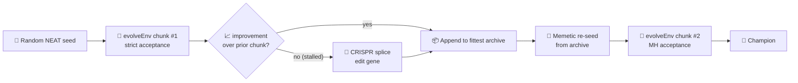

## Summary

Wire the three NEAT-AI hybrid (non-pure-NEAT) techniques — `memetic_evolution`, `crispr_injection`
and `mcmc_acceptance` — on top of the learned 2-opt local search for the `pcb442` TSPLIB instance.
Closes #482.

A new `tsp_two_opt/hybrid.ts` orchestrator chains `evolveEnv` chunks; between chunks the next seed
is the previous chunk's champion (memetic), spliced with a hand-crafted edit gene when the chunk
stalls (CRISPR via `injectGene` from `crispr_injection/`); chunks 2+ run with the
Metropolis-Hastings accept rule so swaps that slightly worsen the tour can still be accepted.
`burma14` and `ulysses22` keep the original single-`evolveEnv` strict-improvement path and their CLI
output is unchanged.

## Evidence

`pcb442` smoke run — all three technique markers fire on a 20-second wall budget under
`TSP_TWO_OPT_QUICK=1`:

```
🧠 memetic re-seed chunk 2/2 seeded from prior champion.
🧬 CRISPR splice chunk 2/2 spliced edit gene into stalled champion (prior improvement 0.0197).
🌡️ MH accept chunk 2/2 using MH acceptance T=0.002.
✅ Champion ratio=2.0% (seed length 61984.05, final length 60761.50, optimum 50778, accepted 2/200, wallclock=2.3s).
🏁 Example completed in 5s 455ms
```

`burma14` regression — identical output shape to the pre-hybrid runner, no markers, strict
acceptance:

```
✅ Champion ratio=6.7% (seed length 38.69, final length 36.11, optimum 3323, accepted 1/200, wallclock=2.1s).
🏁 Example completed in 2s 157ms
```

Full repo test pass: `deno test --parallel ...` → `ok | 977 passed | 0 failed`.

### Flow



## Test Plan

New tests in `tsp_two_opt/hybrid_test.ts` (13 tests, all passing) cover the issue's acceptance
criteria:

- `runHybridEvolution — chunk 2's seed creature matches chunk 1's champion
  export (memetic re-seed)`
  — captures `seedCreatureExport` flowing into the stub evolver and asserts the chunk-2 seed is the
  round-tripped chunk-1 champion (or carries the spliced gene when CRISPR fired).
- `runHybridEvolution — CRISPR splicing fires on a stalled chunk and grows
  the host` — drives the
  orchestrator with a zero-improvement replay so the stall detector fires, then asserts the chunk-2
  seed export contains the two gene-neuron UUIDs (proving `injectGene` was invoked, not grepped).
- `runHybridEvolution — MH acceptance is enabled on chunk 2 and logged` — asserts
  `chunks[1].acceptanceMode === "mh"`, `chunks[1].temperature > 0`, and the three console markers
  (memetic, CRISPR, MH) are emitted.
- `shouldAcceptSwap` — three tests cover MH at positive T accepting a worsening swap with non-zero
  probability and degenerating to strict-improvement at `T → 0`.

Plus targeted tests for `spliceCrisprGene`, `buildTspEditGene`, and `isChunkStalled`.

`burma14` / `ulysses22` regression is guarded by the existing `tsp_two_opt_test.ts` tests
(`parseInstanceFlag --instance=burma14|ulysses22` unchanged) and by re-running
`./tsp_two_opt/run.sh` against `burma14` under `TSP_TWO_OPT_QUICK=1` and confirming no hybrid
markers appear in the output.
