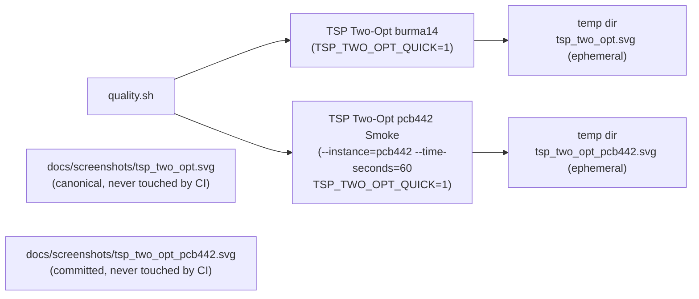

## Summary

Wires the 60-second `pcb442` hybrid smoke into `quality.sh`, commits the proof-of-life smoke SVG at
`docs/screenshots/tsp_two_opt_pcb442.svg`, and updates the `tsp_two_opt` README with the new
`pcb442` supported instance, the `--time-seconds` smoke flag, the three NEAT-AI hybrid techniques
the orchestrator wires together, and the follow-up issue (#484) where the user's overnight champion
artefacts will land. Closes #483.

The runner now picks an instance-specific canonical SVG path so the pcb442 smoke can never overwrite
the canonical burma14 `docs/screenshots/tsp_two_opt.svg`. The CI step inherits the
`TSP_TWO_OPT_QUICK=1` discipline so its ephemeral artefacts are written under a temp directory and
the committed pcb442 SVG is preserved.

## Evidence

- **Smoke SVG artefact**: `docs/screenshots/tsp_two_opt_pcb442.svg` (62 KB) was produced by one real
  `./tsp_two_opt/run.sh --instance=pcb442 --time-seconds=60` run on a commodity laptop. The
  evolveEnv loop ran for ~61 s of wall clock and emitted the three hybrid technique markers
  (`🧠 memetic re-seed`, `🧬 CRISPR splice`, `🌡️ MH accept`); the runner then rendered the
  side-by-side SVG and exited cleanly. The SVG is a valid `<svg>` document (parses and renders in a
  browser) and reports
  `seed length 61984.05 / final length 60532.27 / accepted 1/200 / optimum
  50778` — a smoke-only
  ~2 % improvement over the nearest-neighbour seed, not the SOTA tour length that the user's
  overnight (~8 h) run is expected to reach.

  

- **Canonical burma14 SVG untouched**: the canonical `docs/screenshots/tsp_two_opt.svg` is
  bit-identical to its pre-PR state before and after running the new pcb442 smoke step, both outside
  and inside `TSP_TWO_OPT_QUICK=1` (verified via `diff -q`).

- **CI budget**: the new quality.sh step, with `TSP_TWO_OPT_QUICK=1`, completes in ~13 s of wall
  clock on a commodity laptop — well under the 120 s budget called out in the acceptance criteria.

- **No `docs/data/tsp_two_opt_pcb442/` directory** is created by this PR; the overnight champion
  bundle lands via #484.

## Test Plan

- Added three `screenshotPathForInstance(...)` tests in `tsp_two_opt/tsp_two_opt_test.ts`:
  - `burma14` returns the canonical `docs/screenshots/tsp_two_opt.svg` (also pins the exported
    `SCREENSHOT_PATH` constant).
  - `ulysses22` returns the same canonical path (regression guard — the original single-instance SVG
    path is preserved).
  - `pcb442` returns its own per-instance file `docs/screenshots/tsp_two_opt_pcb442.svg` so the 60 s
    smoke can never overwrite the canonical burma14 SVG.
- `deno fmt`, `deno lint`, `deno check tsp_two_opt/*.ts`, and the full `deno test tsp_two_opt/`
  suite (47 tests) all pass.
- Manually exercised the new quality.sh step twice:
  - Outside `TSP_TWO_OPT_QUICK=1` to produce and commit the pcb442 SVG (`NEAT_MULTI_RUN_BASE_DIR`
    pointed at a temp dir so the burma14 `docs/data/tsp_two_opt/creature.json` was not touched).
  - Inside `TSP_TWO_OPT_QUICK=1` to confirm the CI path skips writing the canonical pcb442 SVG and
    finishes in ~13 s.
