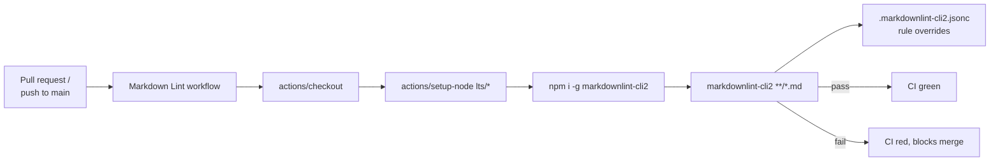

## Summary

Added a Markdown Lint GitHub Actions workflow that runs `markdownlint-cli2` against every `.md` file
on each pull request and push to the default branch. A repository-level `.markdownlint-cli2.jsonc`
config tunes a few rules so existing prose, archived pr-summaries, and the `
` collapsible
sections in `README.md` all lint clean. Closes #49.

## Evidence

This change is purely CI/CD configuration with no UI or runtime impact.

- `markdownlint-cli2 "**/*.md" "#node_modules"` runs cleanly against the current tree (28 files, 0
  errors).
- `deno test --no-check --allow-read --allow-write --allow-env
  .github/workflows/markdown_lint_test.ts`
  — 10/10 tests pass.
- Quality gate run: `./quality.sh` — lint, format, type check, and unit tests all pass. The
  pre-existing `crossover/run.sh` failure (WASM loader) is unrelated to this change and reproduces
  on a clean tree.

## Test Plan

- Added `.github/workflows/markdown_lint_test.ts` with 10 tests that parse the workflow YAML and
  assert:
  - File exists and is valid YAML.
  - Workflow has a name.
  - Triggers on `pull_request` and `push` events.
  - Declares `contents: read` permission.
  - Defines at least one job.
  - Job checks out the repository.
  - Job sets up Node.js.
  - Job invokes `markdownlint-cli2`.
  - Every `uses:` reference is pinned to a 40-character commit SHA (supply-chain rule).
  - `.markdownlint-cli2.jsonc` exists and parses as JSON.
- Manually ran `markdownlint-cli2` locally and confirmed 0 errors.
- Manually ran `./quality.sh` and confirmed lint, format, type check, and unit tests all pass.

## Files

- `.github/workflows/markdown-lint.yml` — new workflow.
- `.github/workflows/markdown_lint_test.ts` — workflow tests.
- `.markdownlint-cli2.jsonc` — rule config (disables MD013 line-length, MD033 inline HTML, MD041
  first-line-h1, MD040 fenced-code-language, MD018 missing-space-atx, MD029 ordered-list-prefix to
  keep historic archived pr-summaries clean).
