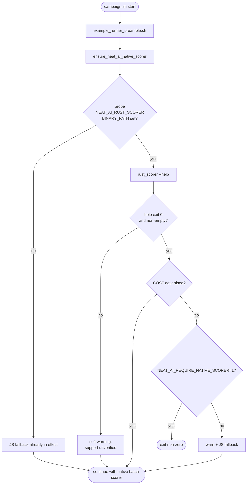

## Summary

The MNIST recorded-evolution campaign evolves with `costName: "CATEGORICAL_ERROR"`, but the sibling
`rust_scorer` binary only forwards batch scoring for that cost once
[NEAT-AI-scorer#134](https://github.com/stSoftwareAU/NEAT-AI-scorer/issues/134) ships. When the
bundled `rust_scorer` is too old, the campaign currently discovers the gap only after the first
generation, then logs
`Batch rust scorer reconciliation failed … CATEGORICAL_ERROR dispatch is blocked` for the rest of
the run.

This PR adds a one-shot start-up probe so operators see a single actionable warning before any
creature is scored:

- New helper `ensure_rust_scorer_supports_cost <COST>` in `common/ensure_neat_ai_native_scorer.sh`
  runs `rust_scorer --help` once and checks whether the cost name is advertised. The probe never
  touches the champion creature or a training fixture, so it cannot violate the warm-start policy.
- Default behaviour when the cost is missing: emit an actionable stderr warning (referencing
  NEAT-AI-scorer#134) and silently fall back to the JS scorer via the existing
  `ensure_neat_ai_native_scorer_use_js_fallback` path.
- `NEAT_AI_REQUIRE_NATIVE_SCORER=1` promotes the warning to a hard failure so unattended overnight
  runs do not silently waste hours on per-creature fallback.
- `mnist_classification/recorded_evolution_campaign.sh` now invokes the probe after sourcing the
  preamble and translates `MNIST_REQUIRE_NATIVE_SCORER=1` into the generic env var.
- `mnist_classification/README.md` documents the minimum scorer capability (all seven built-in
  costs, with `CATEGORICAL_ERROR` mandatory for this example) and how to opt into fail-fast mode.

Closes #502.

## Evidence

This is a CLI-only change — no screenshots. The behavioural matrix is covered by five new
behavioural tests against a fake `rust_scorer` script that prints curated `--help` output,
exercising every branch of the probe (advertised cost, missing cost, missing cost +
`NEAT_AI_REQUIRE_NATIVE_SCORER=1` fail-fast, `--help`-doesn't-work, unset binary path, and
substring-collision rejection).



Test run (5 new tests pass, plus the pre-existing scoped-`--allow-run` regression test still green):

```
running 7 tests from ./common/ensure_neat_ai_native_scorer_test.ts
example runner preamble sets scoped --allow-run for rust_scorer under set -u ... ok (3ms)
ensure_rust_scorer_supports_cost — returns 0 silently when cost is advertised ... ok (356ms)
ensure_rust_scorer_supports_cost — warns and falls back when cost is missing ... ok (348ms)
ensure_rust_scorer_supports_cost — fails fast when NEAT_AI_REQUIRE_NATIVE_SCORER=1 ... ok (113ms)
ensure_rust_scorer_supports_cost — soft warning when --help fails (older binary) ... ok (311ms)
ensure_rust_scorer_supports_cost — no-op when scorer binary path is unset ... ok (8ms)
ensure_rust_scorer_supports_cost — does not match cost as a substring of unrelated tokens ... ok (339ms)
ok | 7 passed | 0 failed (1s)
```

Full `common/` suite continues to pass: `175 passed | 0 failed`.

## Test Plan

- `common/ensure_neat_ai_native_scorer_test.ts` — five new behavioural tests covering every branch
  of the probe helper.
- The pre-existing scoped-`--allow-run` test
  (`example runner preamble sets scoped --allow-run for rust_scorer under set -u`) still passes.
- `shellcheck` clean on both modified shell scripts.
- `deno fmt`, `deno lint`, and `deno check` clean on the modified files.

## Acceptance Criteria

- [x] `ensure_neat_ai_native_scorer` (or sibling helper) surfaces an actionable message when the
      sibling scorer is too old for MNIST — added `ensure_rust_scorer_supports_cost`.
- [x] No warm-start policy violation — probe uses `rust_scorer --help`, never the champion creature
      or a training fixture.
- [ ] Recorded-evolution campaign uses native batch scoring for `CATEGORICAL_ERROR` (no `#88`
      blocker errors in overnight log) — **blocked on upstream
      [NEAT-AI-scorer#134](https://github.com/stSoftwareAU/NEAT-AI-scorer/issues/134)**. This PR is
      the Examples-side preparation: it lights up the actionable warning today and the fail-fast
      switch for overnight runs, and the warning will fall silent automatically once the upstream
      scorer ships and is rebuilt.
