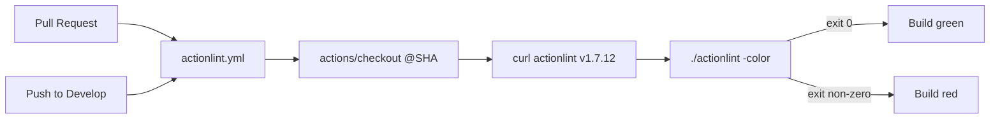

## Summary

Added a dedicated `actionlint` CI workflow that lints every GitHub Actions
workflow under `.github/workflows/` on each pull request and on pushes to
`Develop`. Without this gate, typos and unsafe patterns in workflow YAML
could land on the default branch unnoticed and only surface when a
downstream run broke. The new gate immediately caught and fixed a real
shellcheck issue (SC2035) in `quality.yml` where `deno check **/*.ts`
was missing the `--` end-of-options marker. Closes #508.

## Evidence

CLI gate — local actionlint run is clean across every workflow:

```text
$ actionlint
$ echo $?
0
```

The new gate's structure:



The third-party `actionlint` binary is downloaded directly from the
pinned `rhysd/actionlint` v1.7.12 release tarball — same supply-chain
pattern as `gitleaks.yml` — so the only `uses:` reference is
`actions/checkout` pinned to a 40-character commit SHA.

## Test Plan

- `.github/actionlint_workflow_test.ts` — 8 new TDD tests that pin the
  workflow's contract:
  - file exists and parses as YAML,
  - triggers on `pull_request` against any base branch (`**`),
  - triggers on `push` to `Develop`,
  - declares `permissions: contents: read`,
  - runs on `ubuntu-latest`,
  - every `uses:` reference pins a 40-character commit SHA,
  - actually invokes the `actionlint` binary,
  - exposes a `workflow_dispatch` with required `pr_head_ref` input so
    the CI re-dispatch helper can re-run it after auto-bumps.
- `.github/workflow_branch_filter_test.ts` — added `actionlint.yml` to
  `ALL_BRANCH_WORKFLOWS` so the existing Issue #435 regression test
  also guards the new file's `pull_request.branches` filter.

All 39 tests under `.github/` pass:

```text
$ deno test --allow-read .github/
ok | 39 passed | 0 failed
```
