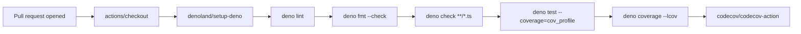

# Add Deno Quality workflow (lint, fmt, type-check, test + coverage)

## Summary

Added a dedicated `Deno Quality` GitHub Actions workflow at `.github/workflows/deno-quality.yml`
that runs `deno lint`, `deno fmt --check`, `deno check`, and `deno test` with code coverage, then
uploads the lcov report to Codecov on every pull request. This complements the existing
`quality.yml` workflow, which also runs the example programs but is gated on the `Develop` branch
only. Closes #51.

The workflow follows the project's supply-chain rules — every third-party action is pinned to a
40-character commit SHA rather than a moving tag.

## Evidence

This is a CI-config-only change (no UI, no runtime code path), so the evidence is the new workflow
YAML plus the unit tests that lock in its required shape. The new workflow runs on every PR and
reports its own status in the PR's checks panel; once merged it will execute itself on subsequent
PRs.



### Test results

```
running 13 tests from ./.github/workflows/deno_quality_test.ts
deno-quality workflow file exists and is valid YAML ... ok
deno-quality workflow has a descriptive name ... ok
deno-quality workflow triggers on pull_request events ... ok
deno-quality workflow declares read-only contents permission ... ok
deno-quality workflow defines at least one job ... ok
deno-quality workflow checks out the repository ... ok
deno-quality workflow installs Deno ... ok
deno-quality workflow runs deno lint ... ok
deno-quality workflow runs deno fmt --check ... ok
deno-quality workflow runs deno check (type checking) ... ok
deno-quality workflow runs deno test with coverage ... ok
deno-quality workflow uploads coverage to Codecov ... ok
deno-quality workflow pins actions to commit SHAs ... ok
ok | 13 passed | 0 failed
```

### Pre-existing `quality.sh` failures

Running `./quality.sh` on this branch reports failures in `Deno Format Check`, `Deno Type Check`,
`Unit Tests`, and the `Intelligent Design`, `Discovery`, and `Crossover` examples. These are
pre-existing on `Develop` and unrelated to this change — the unit-test failures all originate in
`@stsoftware/neat-ai`'s WASM loader (the native module is unavailable locally), and the
`fmt --check` failure is in `docs/pr-summary-50.md` (not touched by this PR).

## Test Plan

- Added `.github/workflows/deno_quality_test.ts` with 13 tests that parse the new workflow YAML and
  assert on its required structure (TDD — tests were written first and confirmed failing before the
  workflow file was added):
  - Valid YAML with a descriptive name
  - Triggers on `pull_request`
  - Declares `contents: read` permission
  - Defines at least one job
  - Checks out the repository (`actions/checkout`)
  - Installs Deno (`denoland/setup-deno`)
  - Runs `deno lint`
  - Runs `deno fmt --check`
  - Runs `deno check` for type checking
  - Runs `deno test` with `--coverage=cov_profile`
  - Generates an lcov report via `deno coverage --lcov`
  - Uploads coverage via `codecov/codecov-action`
  - Pins every action to a 40-character commit SHA
