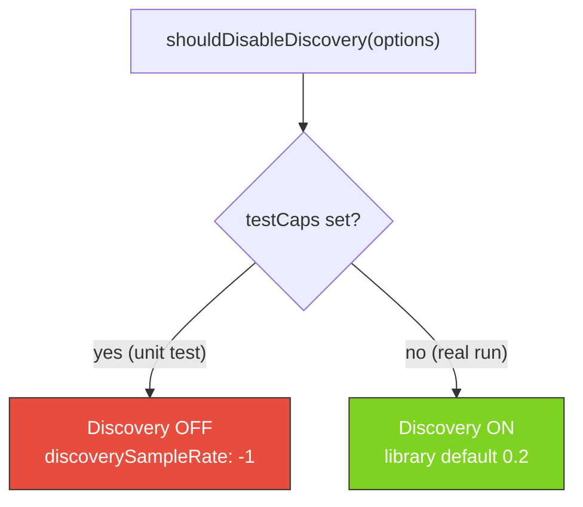

# MNIST: stop disabling structural Discovery for real runs

## Summary

The MNIST example disabled the engine meant to discover network structure. Structural Discovery is
on by default in NEAT-AI (`discoverySampleRate = 0.2`; only `<= 0` disables it), but
`shouldDisableDiscovery()` forced it off whenever `timeoutMinutes <= 0` (and whenever `CI=true`). A
real run with no wall-clock backstop (`timeoutMinutes: 0`) therefore ran with structure discovery
switched off, so it could only weight-mutate a fixed linear topology — explaining the flat ~43 %
after a full day with the champion still equal to the bare `new Creature(784, 10)` seed.

The fix separates the two concerns the predicate had conflated:

- **Wall-clock backstop** (`timeoutMinutes`) — passing `0` still skips the backstop, which is the
  genuine FFI-sanitiser reason tests pass `0`.
- **Structural Discovery** — now gated **solely** on `testCaps`, the unit-test path where NEAT-AI's
  Discovery library trips Deno's `--allow-ffi` leak sanitiser inside `deno test`.

So a normal run keeps `discoverySampleRate` at the library default (Discovery on) regardless of
timeout, and the only remaining disable is test-only and commented.

Closes #516.

## Changes

- `mnist_classification/mnist_classification.ts`
  - `shouldDisableDiscovery()` now returns `true` **only** when `testCaps` is set (exported and
    documented). Removed the `timeoutMinutes <= 0` and `CI === "true"` conditions.
  - Updated the `MnistEvolveOptions.timeoutMinutes` doc comment so it describes only the wall-clock
    backstop and explicitly states it does not control Discovery.
- `mnist_classification/evolve_integration_test.ts` — header comment clarified: `testCaps` disables
  Discovery (FFI sanitiser); `timeoutMinutes: 0` independently skips the backstop.
- `mnist_classification/README.md` — documents that Discovery stays at the default for every real
  run (including `--timeout=0`) and is off only on the unit-test path.

## Behaviour change

Previously `timeoutMinutes <= 0` or `CI=true` also routed to the OFF branch.

## Evidence

Backend/CLI change — no web interface to screenshot. Verified via Deno tests.

- New regression test
  `shouldDisableDiscovery keeps Discovery ON for a normal run regardless of
  timeout` reproduces
  the bug: it asserts `false` for `{ timeoutMinutes: 0 }`, which returned `true` before the fix.
- `shouldDisableDiscovery disables Discovery only on the unit-test path` confirms `testCaps` still
  switches it off (preserving the FFI-sanitiser workaround).
- Full `mnist_classification_test.ts` suite: 38 passed.
- Serial `evolve_integration_test.ts` suite: 7 passed (Discovery stays off via `testCaps`, no FFI
  leak).

Acceptance criteria:

- [x] A normal MNIST run keeps `discoverySampleRate` at the library default (Discovery on) — the
      predicate returns `false` for real runs, so the option is omitted from `NeatOptions`.
- [x] Champion topology can grow beyond the bare seed within a normal run — Discovery is the
      mechanism and is now enabled.
- [x] Any remaining discovery-disable is test-only (`testCaps`) and commented.

## Test Plan

- `deno test mnist_classification/mnist_classification_test.ts` — includes the two new
  `shouldDisableDiscovery` tests.
- `deno test mnist_classification/evolve_integration_test.ts` — unchanged behaviour confirmed.
- `deno fmt --check` / `deno lint` / `deno check` on the changed modules.
