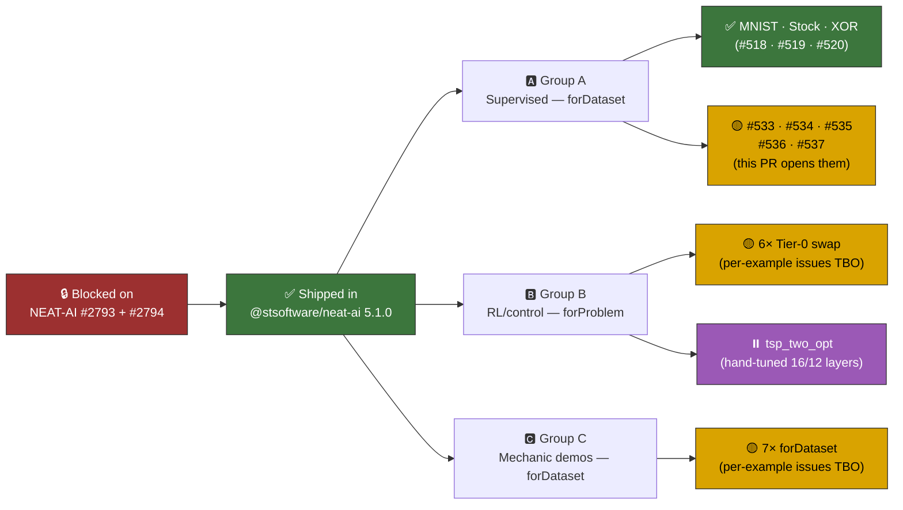

## Summary

Tracking-issue housekeeping for the NEAT-AI **creature factory** adoption across the example suite.
The upstream factory shipped in `@stsoftware/neat-ai@5.1.0`
([NEAT-AI#2794](https://github.com/stSoftwareAU/NEAT-AI/issues/2794) +
[NEAT-AI#2793](https://github.com/stSoftwareAU/NEAT-AI/issues/2793)) and three Group A pilots (MNIST
[#518], Stock Market [#519], XOR [#520]) are already merged into `milestone/factory`. This PR
completes the tracking-issue work that does **not** require per-example code migration:

- **Per-example adoption issues opened** for the five remaining Group A items (acceptance criterion
  #2): adaptive_mutation [#533], evolution_showcase [#534], discovery_at_scale [#535],
  memetic_evolution [#536], crossover [#537].
- **Decisions recorded for Groups B and C** (acceptance criterion #3) in a new
  `docs/factory_adoption.md` decision record — six of seven RL/control examples are clean Tier-0
  `Creature.forProblem(...)` candidates, `tsp_two_opt` is deferred (hand-tuned 16/12 layered seed),
  and all seven mechanic demos are `Creature.forDataset(...)` candidates since their hand-crafted
  state lives outside the NEAT seed.
- **`AGENTS.md` updated** with a "Milestone-sanctioned exception" section so the no-warm-start
  policy explicitly recognises the factory-adoption tracker and points humans / agents at the new
  decision record.
- **Pre-existing `pr-summary-523.md` reformatted** — `deno fmt` was failing on it after the
  squash-merge into `milestone/factory`, so the gate could not pass without the fix.

The five per-example code migrations are tracked under their own issues and will land as separate
PRs, matching the merged-pilot pattern of one issue / one PR per example.

Closes #517.

## Evidence

This is a docs / issue-management change with no code edits and no UI surface. Evidence is:

1. **Five new per-example issues exist on the tracker** —
   [#533](https://github.com/stSoftwareAU/NEAT-AI-Examples/issues/533) (adaptive_mutation),
   [#534](https://github.com/stSoftwareAU/NEAT-AI-Examples/issues/534) (evolution_showcase),
   [#535](https://github.com/stSoftwareAU/NEAT-AI-Examples/issues/535) (discovery_at_scale),
   [#536](https://github.com/stSoftwareAU/NEAT-AI-Examples/issues/536) (memetic_evolution),
   [#537](https://github.com/stSoftwareAU/NEAT-AI-Examples/issues/537) (crossover). All five use a
   common body that points back at `#517` and at the Group A pilot pattern (#518 / #519 / #520).
2. **`deno fmt --check`** passes across all 443 files (the unrelated `pr-summary-523.md` regression
   was fixed in passing).
3. **`deno lint`** passes across all 161 source files.
4. **`markdownlint-cli2`** passes on the two touched / added markdown files.

### Adoption flow

## Test Plan

No code changes — no new tests were added or modified. The pre-PR quality gates run were:

- `deno fmt --check` — passes (443 files).
- `deno lint` — passes (161 files).
- `markdownlint-cli2 docs/factory_adoption.md AGENTS.md docs/archive/pr-summaries/pr-summary-517.md`
  — passes (0 errors).

## Deno regression avoided

- Docs-only PR: no Node tooling, dependencies, or config introduced. Markdown lint goes through
  `markdownlint-cli2` (the existing project tool); no Jest / Prettier / Husky additions.

## Scope note — what this PR does NOT do

- It does **not** migrate any of the five Group A examples to the factory — those land in their own
  PRs against issues #533–#537.
- It does **not** open per-example issues for Groups B and C — those are intentionally deferred
  until Group A completes (per the tracking issue's acceptance criteria).
- It does **not** bump `@stsoftware/neat-ai` — the version on `milestone/factory` (`5.1.0`) already
  contains the factory.
