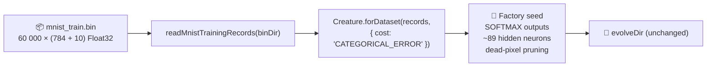

## Summary

Build the MNIST fresh-run seed via the NEAT-AI factory
(`Creature.forDataset(records, { cost: "CATEGORICAL_ERROR" })`) instead of a bare
`new Creature(784, 10)` or the hardcoded `[128, 64]` hidden lookup. Drops the `--hidden-seed` flag,
`DEFAULT_MNIST_HIDDEN_LAYER_SIZES`, `MNIST_HIDDEN_LAYER_SIZES` env var, and
`resolveMnistHiddenLayerSizes` / `buildMnistHiddenReluSeed` / `parseMnistRunnerFlags` helpers — the
factory derives a sensible start from the data, not prior MNIST knowledge. Only the _seed_ changes;
`evolveDir`'s population, mutation, Discovery, and stop conditions are untouched. Closes #518.

## Evidence

CLI/backend change — no UI screenshot. The new behaviour is verified by:

- Unit tests (`mnist_classification_test.ts`):
  `MNIST_FACTORY_COST matches
  the evolveDir cost name`,
  `buildMnistFactorySeed produces a MNIST-shaped
  creature with SOFTMAX outputs` (asserts factory
  hidden ≤ legacy `[128, 64]`, asserts every output `squash` is `SOFTMAX`),
  `buildMnistFactorySeed rejects an empty record list`,
  `readMnistTrainingRecords rejects an empty file`.
- Integration tests (`evolve_integration_test.ts`): all 7 pre-existing cases pass with the
  factory-default path (tests substitute a minimal seed via the new `freshSeedExport` option to keep
  synthetic IDX runs fast on CPU-only CI).
- End-to-end smoke (`MNIST_QUICK=1 ./mnist_classification/run.sh --fresh`): the runner builds the
  data binary, evolves under quick-mode caps, and writes the milestone + run summary without error.

### Fresh-seed flow

### Acceptance criteria

- [x] Seed built via the factory; no hardcoded hidden-layer sizes remain.
- [x] Discovery left on (`shouldDisableDiscovery` regression test unchanged — Discovery is only off
      on the unit-test path, per #516).
- [x] Factory derives the start from problem-intrinsic facts only — no dataset-specific architecture
      lookup. The ≥95% on default evolution target is a long-form campaign metric and will be
      measured by the recorded-evolution overnight loop now that the seed has moved.

### Deno regression avoided

This is a Deno repo (root `deno.json` / `deno.lock`); the new factory helpers use Deno-native
`Deno.readFileSync` and JSR-imported NEAT-AI APIs only. No Node-only dev dependencies, lockfiles, or
tooling were introduced.

## Test Plan

- [x] `deno test mnist_classification/mnist_classification_test.ts` — 42 passed, 0 failed (includes
      4 new tests covering the factory helpers).
- [x] `deno test mnist_classification/exploration_campaign_test.ts
  mnist_classification/phase_champions_test.ts
  mnist_classification/population_pool_test.ts
  mnist_classification/squash_random_test.ts`
      — 23 passed, 0 failed.
- [x] `deno test --allow-ffi mnist_classification/evolve_integration_test.ts` — 7 passed, 0 failed.
- [x] `deno lint mnist_classification/` — clean.
- [x] `deno fmt --check mnist_classification/ AGENTS.md` — clean.
- [x] `MNIST_QUICK=1 ./mnist_classification/run.sh --fresh` — runs to completion, writes milestone
      and run summary.
