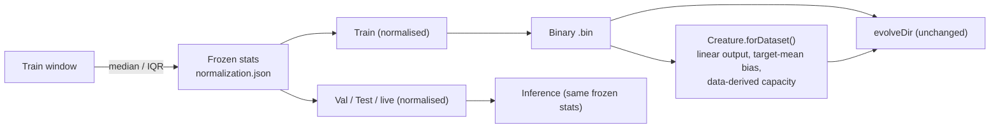

## Summary

Build the Stock-Market example's fresh-run seed via the NEAT-AI **dataset-aware factory**
(`Creature.forDataset(records, { cost: "MSE" })`) instead of a bare `new Creature(WINDOW_SIZE, 1)`,
and add **robust, frozen input normalisation** that travels with the model into inference. This is
the closest example to a production market-prediction use case we operate elsewhere, so it is the
most valuable demonstration of data-derived initialisation on a regression / time-series problem
(part of the factory-adoption tracker #517). **Only the seed and the input transform change — the
`evolveDir` configuration (population, mutation, stop conditions, seed) is untouched.**

Closes #519.

### What changed

- **Factory seed (`buildSeedCreature`).** The fresh-run seed is now built by scanning the training
  data. The factory derives, from problem-intrinsic facts only:
  - a **linear (IDENTITY) regression output** (picked from the `MSE` cost);
  - an **output bias warm-started to the target mean** (≈ 0.63 on the up-skewed S&P 500), so the
    seed predicts the base rate before any training;
  - a **conservative, data-derived hidden-capacity budget** (markets = limited, non-stationary
    samples → overfitting is the main risk);
  - **constant-feature pruning** (synapses from zero-variance inputs are zeroed).
- **Frozen robust normalisation (`computeNormalizationStats` / `applyNormalization` /
  `normalizeSamples`).** Per-feature **median / IQR** statistics are computed on the **training
  window only**, then frozen and reused unchanged for validation, test, and live inference. Median /
  IQR resist the fat-tailed outliers typical of returns; freezing the stats is the
  **non-stationarity safeguard** — the model always sees the exact transform it was trained against,
  and no future information leaks backwards. The stats are persisted to
  `.synthetic-stock/creatures/normalization.json` and embedded in `signals.json`, so the
  normalisation **travels with the model into inference**.
- **`readTrainingRecords`** reconstructs factory records from the written `.bin`, so the factory
  scans exactly the data `evolveDir` trains on.
- The bare-constructor seed (`buildRandomSeedCreature`) is **retained** as the historical baseline
  and for synthetic test/resume fixtures.

### Deliberate departure from the no-warm-start policy

`stock_market` is listed as an in-scope "noise → competent" example in `AGENTS.md`. Adopting the
data-derived factory seed is a **deliberate, milestone-sanctioned exception** under the
factory-adoption tracker (#517): the data-derived seed _is_ the demonstration. `AGENTS.md` and the
example README are updated to record the exception. Structural growth beyond the seed still comes
purely from `evolveDir`'s mutation operators.

## Evidence

This is a backend / CLI change — no web UI to screenshot. Verified via unit tests and an end-to-end
quick-mode run (`STOCK_QUICK=1 ... --fresh`).

### Baseline comparison (seed topology)

| Seed (fresh run)      | Output activation | Output bias         | Hidden neurons | Neurons / synapses\* |
| --------------------- | ----------------- | ------------------- | -------------- | -------------------- |
| Prior `new Creature`  | LOGISTIC          | random              | 0              | 11 / 10              |
| **Factory (this PR)** | IDENTITY (linear) | target mean (≈0.63) | 8              | **19 / 88**          |

\* Neurons counted on the live `Creature` (10 inputs + hidden + 1 output). End-to-end quick run
reported `seed=19/88` for `WINDOW_SIZE=10`, confirming the data-derived hidden layer.

Inputs are now robustly standardised with frozen train-window median/IQR stats, persisted to
`normalization.json` and `signals.json` so the transform is reproducible from the run artefacts.

### Seed + normalisation data flow

## Test Plan

New "what" tests (all call real functions and assert on observable outputs):

- `stock_market/data_test.ts`
  - `computeNormalizationStats` returns per-feature median and IQR; throws on empty input.
  - `applyNormalization` robustly standardises, is robust to a large outlier, guards a constant
    (zero-IQR) feature, and rejects a width mismatch.
  - `normalizeSamples` freezes train stats and reuses them on unseen samples, and does not mutate
    the input.
- `stock_market/stock_market_test.ts`
  - `buildSeedCreature` builds the right arity, sizes a data-derived hidden layer, picks a linear
    (IDENTITY) output, warm-starts the output bias to the target mean, is deterministic
    (weights/biases) for a given seed, produces a valid creature with finite outputs, and throws on
    empty records.
  - `readTrainingRecords` round-trips a written `.bin` into factory records.
  - `evolveStockController` seeds via the factory when not resuming (`seedNeurons > OUTPUT_COUNT`).

Existing tests are unchanged and still pass (the bare-constructor baseline and all multi-run wiring
remain green). Full `./quality.sh` run (fmt, lint, type-check, unit tests, every example in quick
mode) passes.
