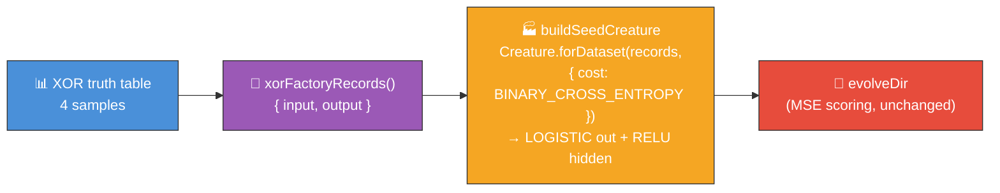

## Summary

Build the XOR example's fresh-run seed via the NEAT-AI **factory**
(`Creature.forDataset(records, { cost: "BINARY_CROSS_ENTROPY" })`) instead of a bare
`new Creature(2, 1)`. XOR is tiny, fast, and deterministic, so it is the ideal **smoke-test** that
the factory produces a valid, well-initialised seed — the binary-classification cost couples the
output to a **LOGISTIC** activation (NEAT-AI #2793), and the factory pre-sizes a small RELU hidden
layer with He/Xavier-scaled weights. **Only the seed changes; evolution is untouched** — the runner
never sets `NeatOptions.costName`, so `evolveDir` keeps its default MSE scoring and the example
converges exactly as before (or faster). Part of the factory-adoption tracker #517.

Closes #520.

### What changed

- **Factory seed (`buildSeedCreature`).** The fresh-run seed is now minted by
  `Creature.forDataset(records, { cost: "BINARY_CROSS_ENTROPY" })`. The factory derives, from
  problem-intrinsic facts only:
  - a **LOGISTIC output** activation, coupled to the classification cost — the exact activation the
    `>= 0.5` threshold interface and the `{0, 1}` MSE contribution both assume;
  - a **conservative hidden-capacity budget** from the problem shape (Heaton's rule → a small RELU
    hidden layer), where the bare constructor produced zero hidden neurons;
  - **per-activation weight init scaling** (He/Xavier), so the forward pass neither saturates nor
    vanishes. Every weight and bias is still drawn from the seeded PRNG — the factory chooses the
    topology and scaling, never hand-crafted parameters.
- **`xorFactoryRecords`** converts the fixed XOR truth table into the `{ input, output }` record
  shape the factory scans, so the seed is derived from the same four samples `evolveDir` trains on.
- **`CLASSIFICATION_COST` constant** documents the cost → activation coupling.
- The bare-constructor seed (`buildRandomSeedCreature`, zero hidden neurons, LOGISTIC output) is
  **retained** as the historical baseline and for test/resume fixtures — its tests are unchanged.

### Deliberate departure from the no-warm-start policy

XOR is an in-scope "noise → competent" example in `AGENTS.md`. Adopting the factory seed is a
**deliberate, milestone-sanctioned exception** under the factory-adoption tracker (#517): smoke-
testing the factory's seed output _is_ the demonstration. The seed weights/biases remain random;
only the topology and scaling are factory-derived, and structural growth beyond the seed still comes
purely from `evolveDir`'s mutation operators with an unchanged configuration.

### Deno regression avoided

- Built the factory records and seed with Deno-native `Float32Array` + `Creature.forDataset`; no
  Node tooling, dependencies, or config introduced.

## Evidence

This is a backend / CLI change with no web interface to screenshot. Evidence is the test suite plus
an end-to-end example run.

- **Unit tests** — all 30 `xor_classification_test.ts` cases pass, including the new factory-seed
  tests and the happy-path convergence test (champion solves XOR with hidden neurons).
- **End-to-end run** — `XOR_QUICK=1 ./xor_classification/run.sh --fresh` completes cleanly, building
  the factory seed, evolving, persisting the champion, and rendering both multi-run charts.

## Test Plan

Added to `xor_classification/xor_classification_test.ts`:

- `xorFactoryRecords returns four records matching the truth table` — record shape/arity/values.
- `buildSeedCreature builds a factory seed with the right arity` — 2 inputs, 1 output.
- `buildSeedCreature picks a LOGISTIC output from the classification cost` — cost → activation
  coupling (the core smoke-test).
- `buildSeedCreature sizes a data-derived hidden capacity budget` — factory pre-sizes a hidden
  layer.
- `buildSeedCreature is deterministic (weights/biases) for a given seed` — same seed ⇒ identical
  learnable parameters; different seed ⇒ different seed.
- `buildSeedCreature produces a valid creature with finite outputs` — validates and activates.
- `buildSeedCreature rejects an empty record set` — error path.

Modified (business-logic-driven, documented):

- `evolveXorController is deterministic for a fixed seed` — now compares a learnable-parameter
  fingerprint (topology shape, squashes, biases, weights) instead of raw JSON, because the factory
  mints fresh random hidden-neuron UUIDs each call. The determinism invariant is preserved.
- `evolveXorController solves XOR and grows hidden neurons (happy path)` — comment updated to
  reflect that the seed now carries factory hidden capacity; the `hidden > 0` assertion is
  unchanged.

No existing tests were removed or disabled.
