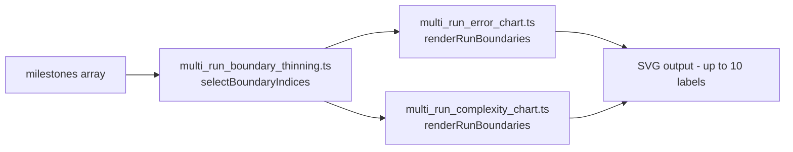

## Summary

Adds auto-thinning to the run-boundary labels and ticks rendered by the two
shared multi-run SVG renderers so that high-run-count campaigns (50, 115, …)
no longer collapse into an unreadable smear at the top of the chart.

Both `multi_run_error_chart.ts` and `multi_run_complexity_chart.ts` now route
their boundary rendering through a single new helper,
`common/multi_run_boundary_thinning.ts`, which encodes the agreed policy in
one place. For ≤ 10 boundaries the output is byte-identical to the previous
implementation; above that the helper auto-fits the largest number of labels
that fit in 90 % of the plot width (capped at 10), always anchoring the first
and last boundary and spacing the intermediate picks evenly.

Closes #521.

## Evidence

This is a backend / SVG-string change with no UI to screenshot — verified via
automated tests:

- A new snapshot regression test
  (`renderMultiRun{Error,Complexity}ChartSVG: 10-run snapshot is
  byte-identical to pre-#521 baseline`) asserts the rendered SVG for a fixed
  10-run input matches a captured baseline byte-for-byte. The baseline was
  recorded before any code change, so a regression in the ≤ 10-run path would
  fail this test.
- New high-run-count tests assert that 50- and 115-run inputs produce at most
  10 boundary `<text>` labels and the same number of `<line class="run-boundary">`
  ticks, and that the first and last boundary are always present.

## Test Plan

- [x] `common/multi_run_boundary_thinning_test.ts` (new, 9 tests):
  - zero / single boundary edge cases,
  - 1 … 10 boundaries → every index selected,
  - 49 / 114 boundary inputs cap at 10 with first + last anchored,
  - selection is deterministic,
  - selection is strictly increasing and roughly evenly spaced,
  - narrow plot width still anchors the last boundary,
  - longer labels shrink the selected count at fixed width.
- [x] `common/multi_run_error_chart_test.ts` (5 new tests):
  - ≤ 10 runs (1, 2, 5, 10) → every boundary labelled, ticks == labels,
  - 50 runs → at most 10 labels, first + last present,
  - 115 runs → at most 10 labels, first + last present,
  - boundary selection is deterministic,
  - 10-run snapshot byte-identical to pre-#521 baseline.
- [x] `common/multi_run_complexity_chart_test.ts` (5 new tests, mirror set).
- [x] All 194 existing tests under `common/` continue to pass.

### Deno regression avoided

Implemented entirely with `deno test`, `deno lint`, `deno fmt`, and
`deno check` — no Node tooling, package.json, or npm/yarn introduced.
