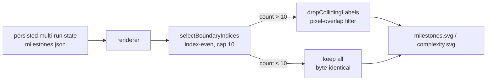

# Regenerate committed multi-run SVG artefacts after auto-thinning lands

## Summary

Regenerated the committed multi-run milestone/complexity SVGs so their run-boundary
layer reflects the auto-thinning shipped in #521. The MNIST campaign accumulated 115
runs (114 boundaries), so its `milestones.svg` and `complexity.svg` previously
collapsed into the unreadable "smear" captured in #514. Every example was re-emitted
from its persisted multi-run state (no fresh evolution); only the MNIST pair shows a
substantive diff — the other 14 SVGs are byte-identical, as expected for ≤10-boundary
campaigns. Closes #522.

While regenerating, the validation revealed that #521's index-even thinning policy still
overlaps labels on a **log-X** axis: the later MNIST runs add only a few generations
each, so their boundaries bunch against the right edge and `run 90 / run 102 / run 115`
collided even after the 10-label cap. To meet the issue's "labels do not overlap at the
default 800 px render width" validation, a small, centralised **position-aware collision
filter** was added to the #521 thinning module and applied by both renderers — but only
on the >10-boundary path, so all ≤10-boundary examples remain byte-identical.

### What changed

- `common/multi_run_boundary_thinning.ts` — added `dropCollidingLabels()` (greedy
  pixel-overlap filter that always keeps the first + last anchors) and
  `selectVisibleBoundaryIndices()` (end-to-end selection: index-even pick, then collision
  filter only when the count exceeds `MAX_BOUNDARY_LABELS`).
- `common/multi_run_error_chart.ts` / `common/multi_run_complexity_chart.ts` — route
  boundary selection through `selectVisibleBoundaryIndices()`.
- `docs/screenshots/mnist_classification/{milestones,complexity}.svg` — regenerated;
  now 7 evenly-spread, non-overlapping `run N` labels (≤10 cap, first = `run 2`,
  last = `run 115`).

### Boundary-label counts after regen (in-scope SVGs)

| Example | boundaries | milestones labels | complexity labels | diff |
| --- | --- | --- | --- | --- |
| mnist_classification | 114 | 7 | 7 | **substantive** |
| lunar_lander | 5 | 5 | 5 | none |
| maze_navigation | 3 | 3 | 3 | none |
| snake_game | 2 | 2 | 2 | none |
| xor_classification | 2 | 2 | 2 | none |
| cart_pole | 1 | 1 | 1 | none |
| mountain_car | 1 | 1 | 1 | none |
| stock_market | 1 | 1 | 1 | none |

Two incidental title-only diffs (`snake_game/milestones.svg` "Snake Game" → "Snake",
`stock_market/milestones.svg` "Stock Market Direction Prediction" → "Stock Market") that
surfaced during regen were reverted — their boundary layers are byte-identical and the
title drift is unrelated to this issue.

### Deno regression avoided

Regeneration was driven entirely through Deno's renderers and `deno run` from the
persisted multi-run state — no Node tooling, bundlers, or fresh evolutionary run.

## Evidence

Both MNIST charts manually rendered to PNG via headless Chrome at the default 800 px
width and visually confirmed: ≤10 `run N` labels, no overlap, first (`run 2`) and last
(`run 115`) present, readable footer caption.

### Acceptance criteria

- [x] All 16 listed SVGs regenerated; only the MNIST pair shows a substantive diff.
- [x] Each regenerated SVG validates as well-formed XML (`xmllint --noout`).
- [x] MNIST `milestones.svg` and `complexity.svg` each contain ≤ 10 `run-boundary`
      `<text>` labels (7 each).
- [x] First (`run 2`) and last (`run 115`) boundary labels present in both MNIST SVGs.
- [x] Before/after MNIST screenshots attached under `docs/evidence/issue-514/`.
- [x] `./quality.sh`: fmt, lint, type-check, 1064 unit tests, MNIST integration tests,
      and all 8 renderer-using example smoke-checks pass. The only failure is a
      pre-existing **JavaScript out-of-memory** in the unrelated *Discovery at Scale*
      evolution (4 GB heap exhaustion after ~11 min) — that example does not use the
      multi-run renderers, so it is not affected by this change.
- [x] #484 pipeline: `tsp_two_opt` does **not** use these renderers (zero `run-boundary`
      markers) so it cannot regress; both committed TSP SVGs remain valid and unchanged.

## Test Plan

New "what" tests in `common/multi_run_boundary_thinning_test.ts`:

- `dropCollidingLabels`: empty / single / two-anchor / well-spaced / overlapping-cluster /
  strictly-increasing-order cases.
- `selectVisibleBoundaryIndices`: ≤10 boundaries keeps every index (byte-identical path);
  clustered log-X boundaries (114) render ≤10 anchored, non-overlapping labels.

Existing #521 renderer tests (including the "10-run snapshot is byte-identical to
pre-#521 baseline" guards) still pass — `selectBoundaryIndices`'s contract is unchanged.
Full suite: `deno fmt --check`, `deno lint`, `deno check`, and 1064 parallel unit tests
pass; `./quality.sh` passes end-to-end.
