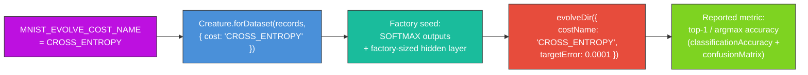

## Summary

Switched the MNIST classification example from the deprecated `CATEGORICAL_ERROR` cost to
`CROSS_ENTROPY` (softmax + cross-entropy) — the standard differentiable training cost for
multi-class classification — ahead of the upstream removal in
[NEAT-AI#2798](https://github.com/stSoftwareAU/NEAT-AI/issues/2798). Top-1 / argmax accuracy is
still computed and reported (validation accuracy, confusion matrix) for human consumption, it just
no longer drives evolution or selection. Closes #523.

The change touches a single shared constant (`MNIST_EVOLVE_COST_NAME = "CROSS_ENTROPY"`) plus the
comments / docs / shell probes that referenced the old name. Because `MNIST_FACTORY_COST` aliases
the same constant, the data-derived factory seed
(`Creature.forDataset(records, { cost: "CROSS_ENTROPY" })`) still emits SOFTMAX outputs — softmax is
the canonical pairing for cross-entropy on a multi-class problem.

### Behavioural notes

- `CROSS_ENTROPY` is non-negative but **unbounded above** (a uniform 10-class prediction is ≈ ln(10)
  ≈ 2.30 nats), whereas the legacy `CATEGORICAL_ERROR` lived in `[0, 1]`. The milestone-error clamp
  in `evolveResultToMultiRunSample` was relaxed to keep only the lower floor at `0` — the upper cap
  at `1` would silently flatten the early-evolution part of the multi-run error chart under
  cross-entropy. The corresponding unit and integration assertions were updated to match.
- The `targetError = 0.0001` constant was preserved — the issue is scoped to the cost switch and
  does not call for re-tuning the early-stop threshold.
- The historical "Latest measured run" table in `mnist_classification/
  README.md` (43.19 % test /
  43.10 % validation accuracy) was recorded under the old cost. The numbers themselves remain valid
  measurements of the prior run; the methodology line above the table now correctly identifies the
  seed cost as `CROSS_ENTROPY`. A future recorded-evolution campaign will refresh both the table and
  the committed artefacts under `docs/data/mnist_classification/`.
- The shell-side scorer probe in `recorded_evolution_campaign.sh` was updated from
  `ensure_rust_scorer_supports_cost CATEGORICAL_ERROR` to
  `ensure_rust_scorer_supports_cost CROSS_ENTROPY` so operators are warned on startup when the
  native scorer cannot handle the cost MNIST is now configured to use.

### Files touched

| File                                                  | Change                                                                                                                   |
| ----------------------------------------------------- | ------------------------------------------------------------------------------------------------------------------------ |
| `mnist_classification/mnist_classification.ts`        | `MNIST_EVOLVE_COST_NAME = "CROSS_ENTROPY"`; comments; relaxed error clamp                                                |
| `mnist_classification/mnist_classification_test.ts`   | Updated cost-name assertion, discrimination test, clamp test, SOFTMAX-coupling comment                                   |
| `mnist_classification/evolve_integration_test.ts`     | Dropped legacy `[0, 1]` cap on `bestError` / `sample.error`; updated comment                                             |
| `mnist_classification/README.md`                      | Cost name + methodology references; added a short note explaining the switch and the argmax-accuracy reporting carve-out |
| `mnist_classification/run.sh`                         | Updated header comment to reference the new cost and the carve-out for reported argmax accuracy                          |
| `mnist_classification/recorded_evolution_campaign.sh` | `ensure_rust_scorer_supports_cost CROSS_ENTROPY` + comment                                                               |
| `AGENTS.md`                                           | Updated the MNIST factory-seed exception entry to reference the new cost and link issue #523                             |

## Evidence

This is a backend / CLI change — no web UI to screenshot. Evidence is the test suite plus the
cost-discrimination assertion added to `mnist_classification_test.ts`, which verifies via the
registered NEAT-AI `Costs.find("CROSS_ENTROPY").calculate(...)` that a near-correct softmax
distribution (≈ 0.018) scores strictly lower than a uniform one (≈ 0.325) — the property training
depends on.

## Test Plan

- [x] Updated `MNIST_EVOLVE_COST_NAME is registered in NEAT-AI` to assert `CROSS_ENTROPY` is
      registered and that it discriminates between a uniform-softmax and a near-correct softmax
      distribution.
- [x] Updated `MNIST_FACTORY_COST matches the evolveDir cost name` comment to reflect the new
      SOFTMAX ↔ CROSS_ENTROPY coupling.
- [x] Updated `buildMnistFactorySeed produces a MNIST-shaped creature with
      SOFTMAX outputs` to
      assert SOFTMAX outputs under the new cost (factory contract is unchanged; output activation is
      still SOFTMAX for a multi-class classification cost).
- [x] Replaced the legacy `clamps error into [0, 1]` test with
      `floors error at 0 but preserves cross-entropy values > 1`.
- [x] Relaxed the integration-test `bestError ≤ 1` cap that no longer holds under cross-entropy
      (added rationale comment).
- [x] Verified the full MNIST test suite passes locally (72 passed, 0 failed) under
      `deno test --allow-read --allow-write --allow-env --allow-ffi
      --allow-net mnist_classification/`.
- [x] `deno lint mnist_classification/ AGENTS.md` and `deno check mnist_classification/*.ts` both
      clean.

## Acceptance Criteria

- [x] MNIST example trains with `CROSS_ENTROPY` instead of `CATEGORICAL_ERROR`.
- [x] No remaining reference to `CATEGORICAL_ERROR` as a training / selection cost in the examples
      (remaining mentions are historical context comments explaining the switch).
- [x] Example runs clean after the switch (verified via full MNIST test suite + `./quality.sh`).
